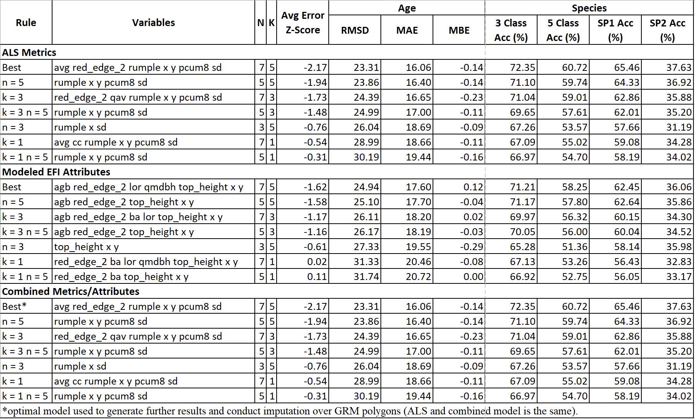
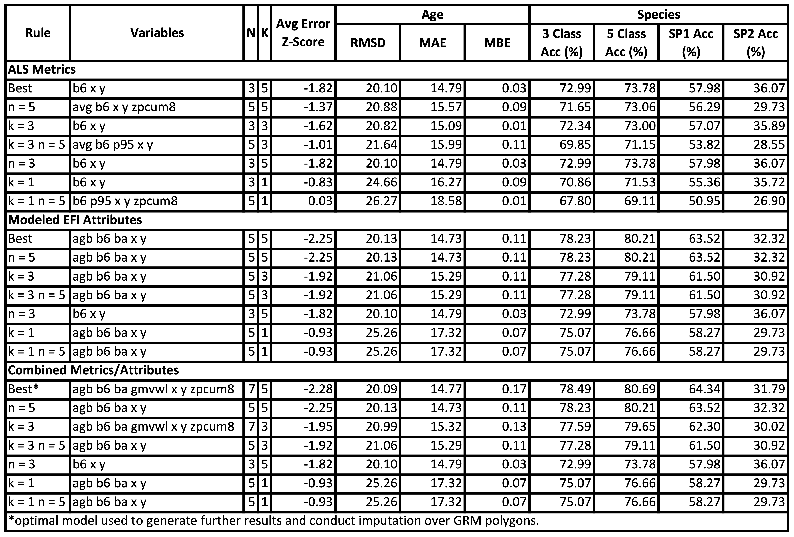

# **7** Imputation Performance Analysis: Comparing RMF and FSF {-#perf}

## **7.1** Introduction {-#perf71}

As mentioned earlier in the imputation workflow, we conducted a performance analysis to explore the optimal combination of imputation X-variables to use in the imputation algorithm. As we conducted this analysis in both the RMF and FSF (and ran the imputation algorithm in both these areas), it is worth sharing the results of the performance analyses. First, some background on the performance analysis itself.

We examined imputation performance using combinations of N = 3, N = 5, and N = 7 X-variables, and K = 1, K = 3, and K = 5 nearest neighbors. We filtered the X-variables into three categories: ALS metrics, EFI attributes, and all variables combined. We were interested to understand whether EFI attributes improved performance as opposed to using ALS metrics derived directly from the point cloud. We included Polygon centroid coordinates (x and) as well as Sentinel-2 red-edge 2 surface reflectance in all categories. We determined the optimal outputs by calculating an average error metric using the following logic:

1. We first derived the error (100 – accuracy) of the four species composition metrics and calculated the mean value. 
2. We then calculated z-scores by centering and scaling the RMSD of age and mean error of species composition by subtracting the mean from each value and dividing by the standard deviation.
3. We then averaged the two z-scores and used the minimum value to dictate optimal models, filtering by category (ALS, EFI, and combined) and combination of n and k. 

Because we calculated the average error z-scores on the full set of model outputs, we compared performance within as well as between categories.

We used the optimal set of X-variables for imputation in the RMF and FSF based on the performance analysis in each respective study area.

## **7.2** Results in RMF {-#perf72}

We do not run the entire code for the performance analysis here -- only results from optimal model outputs are displayed.

## **7.3** Results in FSF {-#perf73}

