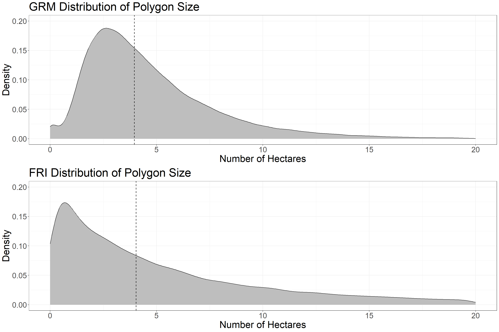

# **4** Segmentation {-#segmentation}

## **4.1** Introduction {-#segmentation41}

Forest stand polygons are familiar to forest managers, used by many forest planning and valuating workflows and software, and thus are preferable for management and monitoring. As the EFI becomes more prevalent, there is an immediate need to create a systematic workflow to convert raster-based metrics into a familiar polygonal format with the goal of ensuring usability and a seamless transition from the traditional forest inventory to the EFI. Although it is straight-forward to average EFI attributes over existing inventory polygons, these polygons are out of date (Bilyk et al., 2021) and do not represent the current conditions of dynamic forested environments. Manual delineation of forest stands is challenging since there are a lack of expert photo interpreters, the process is slow and expensive, and the subjective nature of the delineation makes monitoring of resources through time difficult (Wulder et al., 2008). Thus, to improve forest inventories our first step is to automatically delineate forest stand polygons from ALS data representing current conditions.

Segmenting grid data (such as metrics derived from ALS) into meaningful polygonal objects is a well-documented process of geographic object-based image analysis. [Generic Region Merging (GRM)](https://www.orfeo-toolbox.org/CookBook/Applications/app_GenericRegionMerging.html), available from Orfeo Toolbox, is a region merging algorithm which has three options for homogeneity criterion: Baatz & Schape, Eclidean Distance, and Full Lambda. The Baatz & Schape criterion (Baatz and Schäpe, 2000), is the same algorithm used by the popular subscription based Multi-resolution Segmentation (eCognition software), and thus GRM provides an open-source framework to access the most popular segmentation method for remote sensing applications (Blaschke, 2010).

How do we know if the segmentation is "good"? There are no universal criteria to assess the ability of segmentation algorithms to accurately delineate features in data. Judging performance depends on the application, and may include factors such as radiometric variation within segments, contrast to other segments, segment shape, size and distribution, number of segments, and other application specific metrics such as number of landcover classes within each segment, or classification accuracy. In terms of applying segmentation to ALS data in order to generate representative forest stand polygons, we assess the segmentation results in terms of ease, efficiency, and replicability of the algorithm (thus choosing GRM), segment shape, number of segments, line work (not having multiple sets of parallel lines), and effectiveness at explaining input metric variation. Results are discussed below.


## **4.2** Generic Region Merging Parameters {-#segmentation42}

Output polygon specifications depend largely on parameter selection. For the GRM algorithm, the parameters include threshold, weight of spectral homogeneity, and weight of spatial homogeneity. Although the algorithm is based on the same homogeneity criterion as Multi-resolution Segmentation (eCognition software), the parameter selection is executed differently. Segments will merge if the value of the criterion is under the threshold, which controls spectral variation and segment size. The weight of spectral heterogeneity is a value between 0.1 – 0.9 and sets the priority of color vs. shape. This value inherently sets the weight of shape, since the weight of spectral homogeneity (color) and the weight of shape sum to 1. The weight of spatial homogeneity is a value between 0.1 – 0.9 that controls the priority of compactness vs. smoothness. The value inherently sets the weight of smoothness, since the weight of spatial homogeneity (compactness) and the weight of smoothness sum to 1.

eCognition has a [great video](https://www.youtube.com/watch?v=tt53hoRAw9Q) that explains parameter selection for their Multi-resolution Segmentation algorithm. The concepts apply directly to the GRM algorithm, just remember the parameters you adjust in GRM are slightly different.

## **4.3** Data Requirements {-#segmentation43}

The GRM segmentation workflow requires the following data layers, which are input into the algorithm at the beginning of the code:

1. Gridded raster layers of the following ALS metrics, which are used to segment the data into polygons:

* p95: 95th percentile of returns height > 1.3 meters classified as vegetation
* cc: Canopy cover. Percentage of first returns > 2 meters classified as vegetation
* cv: Coefficient of variation of returns height > 1.3 meters classified as vegetation

We use these layers as they represent the height, cover, and vertical complexity of the forest. We do not go into detail about how to pre-process ALS layers from the point cloud. These metrics were processed using the [lidR](https://r-lidar.github.io/lidRbook/) package in R. One thing to note is that we are using ALS metrics derived directly from the point cloud, as opposed to EFI attributes modelled using an area-based approach. EFI attributes are only valid in forested areas, and we want to generate polygons for the entire landscape, later classifying polygons as forested or not.

2. Forest Resources Inventory polygons (shapefile)

The polygons need to have a "polytype" attribute field, as the "WAT" value is used to mask water

3. A roads layer (shapefile)

This layer is used to mask roads and re-add them after segmentation. It may not be necessary to mask small roads that can be included in segmentation.

4. VLCE 2.0 Canada-wide Landcover data. [Download here.](https://opendata.nfis.org/mapserver/nfis-change_eng.html)

We use 2018 to match the year of aquisition of the ALS data.

5. A valid [Orfeo Toolbox Installation](https://www.orfeo-toolbox.org/CookBook/Installation.html)

Orfeo Toolbox is run from the command line but we execute the GRM function through R. All analyses are run in [R using RStudio](https://posit.co/download/rstudio-desktop/) -- so having a valid installation is necessary too.

## **4.4** Set Code and File Parameters {-#segmentation44}

Now working in R, we will showcase a demo workflow, segmenting the Romeo Malette Forest (RMF) into forest stand polygons. The first step is to install packages (if not already installed) and set the code and file parameters. The input file locations are referenced and the GRM parameters are set. After conducting a performance analysis with many algorithm iterations, we are setting threshold (10), spectral homogeneity (0.1) and spatial homogeneity (0.5).


```r
##################################
### INSTALL PACKAGES IF NEEDED ###
##################################

# install.packages(c('terra',
#                    'tidyverse',
#                    'exactextractr',
#                    'sf',
#                    'janitor',
#                    'berryFunctions',
#                    'lwgeom',
#                    'magrittr',
#                    'gridExtra'))

# make sure to have OTB installed from here:
# https://www.orfeo-toolbox.org/

#####################
### LOAD PACKAGES ###
#####################

# load packages
library(terra)
library(tidyverse)
library(exactextractr)
library(sf)
library(janitor)
library(berryFunctions)
library(lwgeom)
library(magrittr)
library(gridExtra)

####################################
### SET CODE AND FILE PARAMETERS ###
####################################

# set file names for ALS input variables
# these should be gridded raster data with the same CRS and extent
# p95 = 95th percentile of returns height > 1.3 m
# cc = canopy cover (% of firest returns > 2 m)
# cv = coefficient of variation of returns height > 1.3 m
p95_f <- 'D:/ontario_inventory/romeo/RMF_EFI_layers/SPL100 metrics/RMF_20m_T130cm_p95.tif'
cc_f <- 'D:/ontario_inventory/romeo/RMF_EFI_layers/SPL100 metrics/RMF_20m_T130cm_2m_cov.tif'
cv_f <- 'D:/ontario_inventory/romeo/RMF_EFI_layers/SPL100 metrics/RMF_20m_T130cm_cv.tif'

# set file location of roads shape file (spatial lines)
# roads will be polygonized, masked from segmentation
# and re-added to final dataset as polygons
roads_f <-
  'D:/ontario_inventory/romeo/RMF_EFI_layers/Roads/RMF_roads.shp'

# set file location of FRI polygons shape file
# FRI POLYTYPE should have a "WAT" classification to mask water polygons
fri <- 'D:/ontario_inventory/romeo/RMF_EFI_layers/Polygons Inventory/RMF_PolygonForest.shp'

# set output folder for files generated
# make sure no "/" at end of folder location!
out_dir <- 'C:/Users/bermane/Desktop/RMF'

# set folder location of OTB (where you installed OTB earlier)
otb_dir <- "C:/OTB/bin"

# set GRM segmentation parameters
# the default are listed below
# refer to paper or OTB GRM webpage for description of parameters
thresh <- "10"
spec <- "0.1"
spat <- "0.5"

# set file location of 2018 VLCE 2.0 landcover data
# using 2018 because it is the year of Romeo ALS acquisition
# can change based on ALS acquisition year
# download here:
# https://opendata.nfis.org/mapserver/nfis-change_eng.html
lc_f <- 'D:/ontario_inventory/VLCE/CA_forest_VLCE2_2018.tif'
```

## **4.5** Pre-processing {-#segmentation45}

Before executing the GRM algorithm, we prepare the data. First, a three band raster at 20 m spatial resolution is generated from the gridded ALS metrics. Each band is smoothed using the mean value of a 5x5 neighborhood. Next, we mask roads and water features from the raster, and combine them into a polygon layer to be re-added to the segmentation output. We then remove pixels that have missing values in any of the raster bands, and scale the bands to comprise values from 0-100, setting the minimum and maximum values to be the 1st and 99th percentile of data observations. We write the raster and masked polygons to disk to be loaded later.


```r
###################################################
### LOAD MULTI BAND ALS RASTER FOR SEGMENTATION ###
###################################################

# stack rasters
spl <- rast(c(p95_f, cc_f, cv_f))

# apply smoothing function on 5 cell square
spl[[1]] <- focal(spl[[1]], w = 5, fun = "mean")
spl[[2]] <- focal(spl[[2]], w = 5, fun = "mean")
spl[[3]] <- focal(spl[[3]], w = 5, fun = "mean")

# create ALS template with all values equal to 1
spl_temp <- spl[[1]]
spl_temp[] <- 1

##################
### MASK ROADS ###
##################

# load roads layer
roads <- vect(roads_f)

# reproject to match lidar
roads <- project(roads, spl)

# create roads polygon
spl_r <- mask(spl_temp, roads, touches = T)
npix <- sum(values(spl_r), na.rm = T)
spl_r <- as.polygons(spl_r)
names(spl_r) <- 'POLYTYPE'
spl_r$POLYTYPE <- 'RDS'
spl_r$nbPixels <- npix

# mask road pixels to NA
spl <- spl %>%
  mask(., roads, inverse = T, touches = T)

###########################
### MASK WATER POLYGONS ###
###########################

# water polygons from the FRI are masked and re-added after segmentation

# load photo interpreted polygons
poly <- vect(fri)

# subset polygons that are WAT
poly_sub <- poly[poly$POLYTYPE %in% c('WAT')]

# reproject to match lidar
poly_sub <- project(poly_sub, spl)

# loop through water polygons, mask raster, and vectorize
for (i in 1:length(poly_sub)) {
  pt <- poly_sub$POLYTYPE[i]
  if (i == 1) {
    spl_pt <- spl_temp %>% crop(poly_sub[i], snap = 'out') %>%
      mask(poly_sub[i], touches = T)
    npix <- sum(values(spl_pt), na.rm = T)
    spl_pt <- as.polygons(spl_pt)
    names(spl_pt) <- 'POLYTYPE'
    spl_pt$POLYTYPE <- pt
    spl_pt$nbPixels <- npix
  } else{
    if (is.error(spl_temp %>% crop(poly_sub[i], snap = 'out') %>%
                 mask(poly_sub[i], touches = T)) == F) {
      spl_hold <- spl_temp %>% crop(poly_sub[i], snap = 'out') %>%
        mask(poly_sub[i], touches = T)
      npix <- sum(values(spl_hold), na.rm = T)
      spl_hold <- as.polygons(spl_hold)
      names(spl_hold) <- 'POLYTYPE'
      spl_hold$POLYTYPE <- pt
      spl_hold$nbPixels <- npix
      spl_pt <- rbind(spl_pt, spl_hold)
    }
  }
}

# reproject whole FRI to match lidar
poly <- project(poly, spl)

# mask lidar outside of FRI
spl <- mask(spl, poly, inverse = F, touches = T)

# mask WAT polygons
spl <- mask(spl, poly_sub, inverse = T, touches = T)

###############################################
### COMBINE ROAD AND WATER POLYGON DATASETS ###
###############################################

spl_pt <- rbind(spl_pt, spl_r)

##########################################
### DEAL WITH MISSING DATA AND RESCALE ###
##########################################

# if any band is missing values set all to NA
spl[is.na(spl[[1]])] <- NA
spl[is.na(spl[[2]])] <- NA
spl[is.na(spl[[3]])] <- NA

# create function to rescale values from 0 to 100 using 1 and 99 percentile
scale_100 <- function(x) {
  # calculate 1st and 99th percentile of input raster
  perc <-
    values(x, mat = F) %>% quantile(., probs = c(0.01, 0.99), na.rm = T)
  
  # rescale raster using 1st and 99th %
  x <- (x - perc[1]) / (perc[2] - perc[1]) * 100
  
  #reset values below 0 and above 100
  x[x < 0] <- 0
  x[x > 100] <- 100
  
  return(x)
}

# rescale rasters from 0 to 100
spl[[1]] <- scale_100(spl[[1]])
spl[[2]] <- scale_100(spl[[2]])
spl[[3]] <- scale_100(spl[[3]])

# check if main dir exists and create
if (dir.exists(out_dir) == F) {
  dir.create(out_dir)
}

# check if temp dir exists and create
if (dir.exists(file.path(out_dir, 'temp')) == F) {
  dir.create(file.path(out_dir, 'temp'))
}

# write raster to tif
writeRaster(spl,
            filename = str_c(out_dir, '/temp/spl_stack.tif'),
            overwrite = T)

# write spl_pt
writeVector(spl_pt,
            str_c(out_dir, '/temp/water_roads_polygons.shp'),
            overwrite = T)
```

## **4.6** Execute GRM Segmentation {-#segmentation46}

The next step is to execute the GRM algorithm itself. We set the parameters, write a function to run GRM in the command line, and execute the function. The result is the segmented polygon layer, which then needs some post-processing before looking at performance results.


```r
#######################
###RUN GRM ALGORITHM###
#######################

# SET PARAMETERS
rast_in <- str_c(out_dir, '/temp/spl_stack.tif')
out_p <- str_c(out_dir, '/temp')
name_out <- str_c(
  'grm_',
  thresh,
  '_',
  gsub(".", "", spec, fixed = TRUE),
  '_',
  gsub(".", "", spat, fixed = TRUE)
)

# create function to run generic region merging
grm_otb <-
  function(otb_path = "",
           raster_in = "",
           out_path = "",
           name = "",
           method = "bs",
           thresh = "",
           spec = "0.5",
           spat = "0.5") {
    # Set configuration
    conf <-
      paste(
        "-in",
        raster_in,
        "-out",
        paste(out_path, "/", name, ".tif", sep = ""),
        "-criterion",
        method,
        "-threshold",
        thresh,
        "-cw",
        spec,
        "-sw",
        spat
      )
    
    # apply function in command line
    system(paste(otb_path, "/otbcli_GenericRegionMerging", " ", conf, sep =
                   ""))
    
    # save configuration for further use
    write.table(
      x = conf,
      file = paste(out_path, "/", name, "_conf.txt", sep = ""),
      row.names = F,
      col.names = F
    )
  }

# run grm
grm_otb(
  otb_path = otb_dir,
  raster_in = rast_in,
  out_path = out_p,
  name = name_out,
  thresh = thresh,
  spec = spec,
  spat = spat
)
```

## **4.7** Post-processing {-#segmentation47}

Before examining results, we mask missing values in the segmentation output, re-add water and road polygons (that were masked from input raster), and add landcover values. We use landcover to calculate two attributes: 

1. The dominant landcover type in each polygon (mode)

2. Whether each polygon is considered forested (> 50% landcover is forest).


```r
###########################
### MASK MISSING VALUES ###
###########################

# load grm raster
p <- rast(str_c(out_p, "/", name_out, ".tif"))

# load seg raster
mask <- rast(rast_in) %>% .[[1]]

# mask grm raster
p <- mask(p, mask)

# write grm raster
writeRaster(p, paste(out_p, "/", name_out, ".tif", sep = ""),
            overwrite = T)

# convert to vector based on cell value
vec <- as.polygons(p)

# create table of number of pixels in each polygon
num <- as.vector(values(p))
num_pix <- tabyl(num)

# drop na row
num_pix <- na.omit(num_pix)

# get pixel ids from vector
vec_dat <- tibble(id = values(vec)[, 1])
colnames(vec_dat) <- 'id'

# loop through values and add to vector data
vec_dat$nbPixels <- NA
for (i in 1:NROW(vec_dat)) {
  vec_dat$nbPixels[i] <- num_pix$n[num_pix$num == vec_dat$id[i]]
}

# remove current column of data and add id
# add nbPixels to vector
vec <- vec[, -1]
vec$id <- vec_dat$id
vec$nbPixels <- vec_dat$nbPixels

##################################
### ADD PRE-ALLOCATED POLYGONS ###
##################################

# load polygon dataset
p <- vec

# reproject segmented polygons to ensure same crs
p <- project(p, spl_pt)

# add non-FOR POLYTYPE polygons back in
p2 <- rbind(p, spl_pt)

#####################
### ADD LANDCOVER ###
#####################

# load VLCE 2.0 landcover dataset
lc <- rast(lc_f)

# project polygons to CRS of raster
p_lc <- project(p2, lc)

# crop raster
lc <- crop(lc, p_lc)

# convert to sf
p_lcsf <- st_as_sf(p_lc)

# extract landcover values
lc_vals <- exact_extract(lc, p_lcsf)

# set landcover class key
lc_key <- c(`0` = 'NA',
            `20` = 'Water',
            `31` = 'Snow/Ice',
            `32` = 'Rock/Rubble',
            `33` = 'Exposed/Barren Land',
            `40` = 'Bryoids',
            `50` = 'Shrubland',
            `80` = 'Wetland',
            `81` = 'Wetland-Treed',
            `100` = 'Herbs',
            `210` = 'Coniferous',
            `220` = 'Broadleaf',
            `230` = 'Mixed Wood')

# find dominant lc type in each polygon
# if there are multiple modes keep them
# apply over list
lc_mode <- sapply(lc_vals, function(x){
  x$value <- recode(x$value, !!!lc_key)
  x <- x %>% group_by(value) %>% summarize(sum = sum(coverage_fraction))
  m <- x$value[which(x$sum == max(x$sum))]
  # m <- get_mode2(x$value[x$coverage_fraction >= cov_frac])
  return(paste(m, collapse = " "))
})

# add to polygon dataset
p2$dom_lc <- lc_mode

# set landcover class key with single forested class
lc_key_for <- c(`0` = 'NA',
                `20` = 'Water',
                `31` = 'Snow/Ice',
                `32` = 'Rock/Rubble',
                `33` = 'Exposed/Barren Land',
                `40` = 'Bryoids',
                `50` = 'Shrubland',
                `80` = 'Wetland',
                `81` = 'Forest',
                `100` = 'Herbs',
                `210` = 'Forest',
                `220` = 'Forest',
                `230` = 'Forest')

# find pixels with forest at least 50% of pixel
# apply over list
lc_dom_for <- sapply(lc_vals, function(x){
  x$value <- recode(x$value, !!!lc_key_for)
  x <- x %>% group_by(value) %>% summarize(sum = sum(coverage_fraction))
  m <- x$value[which(x$sum == max(x$sum))]
  if((length(m) == 1) & (m == 'Forest')[1]){
    if(x$sum[x$value == m]/sum(x$sum) >= 0.5){
      return('Yes')
    }else{return('No')}
  }else{return('No')}
})

# add to polygon dataset
p2$dom_for <- lc_dom_for
```

## **4.8** Performance Analysis {-#segmentation48}

To compare newly segmented forest stand polygons to those from the FRI, we calculate a full suite of summary and performance metrics including: 

1. Minimum, maximum, mean, and median polygon size
2. Total number of polygons 
3. Mean, standard error, and standard deviation of polygon area, perimeter, perimeter to area ratio and shape index
4. R2 to assess the performance of segmentation outputs in explaining variation in the input variables: P95 height, canopy cover, and coefficient of variation

The details pertaining to the derivation of these metrics are included in a forthcoming journal article. The following code chunk calculates stats for both the GRM output and the FRI polygons, outputting them together in a file titled "summary_stats.csv".


```r
##############################
### ADD AREA AND PERIMETER ###
##############################

# convert to sf
p2_sf <- st_as_sf(p2)

# calculate perimeter
p2$perim <- st_perimeter(p2_sf) %>% as.numeric

# calculate area
p2$area <- st_area(p2_sf) %>% as.numeric

# write to file
writeVector(p2, str_c(out_dir, "/", name_out, ".shp"),
            overwrite = T)

###########################################
### EXTRACT FINAL POLYGON SUMMARY STATS ###
###########################################

# create list of polygon files, names and parameters
file <- str_c(out_dir, "/", name_out, ".shp")
out_loc <- out_dir
grm_input <- str_c(out_dir, '/temp/spl_stack.tif')
name <- name_out

# create standard error function
se <- function(x)
  sd(x) / sqrt(length(x))

# load file
p <- vect(file)

# convert to sf
p_sf <- st_as_sf(p)

# subset non masked WAT and RD polygons
p2_sf <- p[is.na(p$POLYTYPE)] %>% st_as_sf
p2 <- p[is.na(p$POLYTYPE)] %>% as.data.frame

# calculate perimeter to area ratio
p2$p_to_a <- p2$perim / p2$area
p2$p_to_a <- round(p2$p_to_a, 3)

# calculate msi
p2$msi <- p2$perim / sqrt(pi * p2$area)

# load original raster input file
ras <- rast(grm_input)

# rename bands
names(ras) <- c('p95', 'cc', 'cv')

# extract pixel values
pvals <- exact_extract(ras, p2_sf)

# calculate SSE
sse <- sapply(
  pvals,
  FUN = function(x) {
    p95_mean <- mean(x$p95, na.rm = T)
    cc_mean <- mean(x$cc, na.rm = T)
    cv_mean <- mean(x$cv, na.rm = T)
    
    return(c(sum((x$p95 - p95_mean) ^ 2, na.rm = T),
             sum((x$cc - cc_mean) ^ 2, na.rm = T),
             sum((x$cv - cv_mean) ^ 2, na.rm = T)))
  }
)

# transpose
sse <- t(sse)

# calculate final sums
sse <- colSums(sse)

# unlist values
pvals2 <- do.call(rbind, pvals)

# calculate global mean values
p95_mean <- mean(pvals2$p95, na.rm = T)
cc_mean <- mean(pvals2$cc, na.rm = T)
cv_mean <- mean(pvals2$cv, na.rm = T)

rm(pvals2)

# calculate SST
sst <- sapply(
  pvals,
  FUN = function(x) {
    return(c(sum((x$p95 - p95_mean) ^ 2, na.rm = T),
             sum((x$cc - cc_mean) ^ 2, na.rm = T),
             sum((x$cv - cv_mean) ^ 2, na.rm = T)))
  }
)

# transpose
sst <- t(sst)

# calculate final sums
sst <- colSums(sst)

# calculate r2 values
r2_p95 <- 1 - (sse[1] / sst[1]) %>% round(3)
r2_cc <- 1 - (sse[2] / sst[2]) %>% round(3)
r2_cv <- 1 - (sse[3] / sst[3]) %>% round(3)
r2_all <- (sum(r2_p95, r2_cc, r2_cv) / 3) %>% round(3)

# create dataframe with values wanted
df <- data.frame(
  alg = name,
  min_pix = (min(p2$nbPixels)),
  max_pix = (max(p2$nbPixels)),
  mean_pix = (mean(p2$nbPixels)),
  med_pix = (median(p2$nbPixels)),
  num_poly = NROW(p2),
  mean_area = mean(p2$area),
  se_area = se(p2$area),
  sd_area = sd(p2$area),
  mean_perim = mean(p2$perim),
  se_perim = se(p2$perim),
  sd_perim = sd(p2$perim),
  mean_p_a = mean(p2$p_to_a),
  se_p_a = se(p2$p_to_a),
  sd_p_a = sd(p2$p_to_a),
  mean_msi = mean(p2$msi),
  se_msi = se(p2$msi),
  sd_msi = sd(p2$msi),
  r2_p95 = r2_p95,
  r2_cc = r2_cc,
  r2_cv = r2_cv,
  r2_all = r2_all
)

# round numeric columns
df %<>%
  mutate_at(c(
    'min_pix',
    'max_pix',
    'mean_pix',
    'med_pix',
    'mean_area',
    'se_area',
    'sd_area',
    'mean_perim',
    'se_perim',
    'sd_perim'
  ),
  function(x)
    round(x, 2)) %>%
  mutate_at(c('mean_p_a',
              'se_p_a',
              'sd_p_a',
              'mean_msi',
              'se_msi',
              'sd_msi'),
            function(x)
              round(x, 4))

#####################
### ADD FRI STATS ###
#####################

# load interpreter derived polygons to extract statistics
pfri <- vect(fri)

# convert to sf
pfri_sf <- st_as_sf(pfri)

# calculate perimeter
pfri$perim <- st_perimeter(pfri_sf) %>% as.numeric

# calculate area
pfri$area <- st_area(pfri_sf) %>% as.numeric

# calculate nbPixels
pfri$nbPixels <- pfri$area / 400

# calculate perimeter to area ratio
pfri$p_to_a <- pfri$perim / pfri$area
pfri$p_to_a <- round(pfri$p_to_a, 3)

# subset all non water/ucl polygons
p2fri_sf <- pfri[!(pfri$POLYTYPE %in% c('WAT', 'UCL'))] %>% st_as_sf
p2fri <- pfri[!(pfri$POLYTYPE %in% c('WAT', 'UCL'))] %>% as.data.frame

# calculate msi
p2fri$msi <- p2fri$perim / sqrt(pi * p2fri$area)

# load original raster input file
ras <- rast(grm_input)

# rename bands
names(ras) <- c('p95', 'cc', 'cv')

# extract pixel values
pvals <- exact_extract(ras, p2fri_sf)

# calculate SSE
sse <- sapply(
  pvals,
  FUN = function(x) {
    # subset values based on coverage fraction
    x %<>% filter(coverage_fraction >= 0.5)
    
    p95_mean <- mean(x$p95, na.rm = T)
    cc_mean <- mean(x$cc, na.rm = T)
    cv_mean <- mean(x$cv, na.rm = T)
    
    return(c(sum((x$p95 - p95_mean) ^ 2, na.rm = T),
             sum((x$cc - cc_mean) ^ 2, na.rm = T),
             sum((x$cv - cv_mean) ^ 2, na.rm = T)))
  }
)

# transpose
sse <- t(sse)

# calculate final sums
sse <- colSums(sse)

# unlist values
pvals2 <- do.call(rbind, pvals)

# subset values based on coverage fraction
pvals2 %<>% filter(coverage_fraction >= 0.5)

# calculate global mean values
p95_mean <- mean(pvals2$p95, na.rm = T)
cc_mean <- mean(pvals2$cc, na.rm = T)
cv_mean <- mean(pvals2$cv, na.rm = T)

rm(pvals2)

# calculate SST
sst <- sapply(
  pvals,
  FUN = function(x) {
    # subset values based on coverage fraction
    x %<>% filter(coverage_fraction >= 0.5)
    
    return(c(sum((x$p95 - p95_mean) ^ 2, na.rm = T),
             sum((x$cc - cc_mean) ^ 2, na.rm = T),
             sum((x$cv - cv_mean) ^ 2, na.rm = T)))
  }
)

# transpose
sst <- t(sst)

# calculate final sums
sst <- colSums(sst)

# calculate r2 values
r2_p95 <- 1 - (sse[1] / sst[1]) %>% round(3)
r2_cc <- 1 - (sse[2] / sst[2]) %>% round(3)
r2_cv <- 1 - (sse[3] / sst[3]) %>% round(3)
r2_all <- (sum(r2_p95, r2_cc, r2_cv) / 3) %>% round(3)

# create dataframe with values wanted
ms_df <- data.frame(
  alg = 'FRI',
  min_pix = (min(p2fri$area / 400)),
  max_pix = (max(p2fri$area / 400)),
  mean_pix = (mean(p2fri$area / 400)),
  med_pix = (median(p2fri$area / 400)),
  num_poly = NROW(p2fri),
  mean_area = mean(p2fri$area),
  se_area = se(p2fri$area),
  sd_area = sd(p2fri$area),
  mean_perim = mean(p2fri$perim),
  se_perim = se(p2fri$perim),
  sd_perim = sd(p2fri$perim),
  mean_p_a = mean(p2fri$p_to_a),
  se_p_a = se(p2fri$p_to_a),
  sd_p_a = sd(p2fri$p_to_a),
  mean_msi = mean(p2fri$msi),
  se_msi = se(p2fri$msi),
  sd_msi = sd(p2fri$msi),
  r2_p95 = r2_p95,
  r2_cc = r2_cc,
  r2_cv = r2_cv,
  r2_all = r2_all
)

# round numeric columns
ms_df %<>%
  mutate_at(c('min_pix',
              'max_pix',
              'mean_pix',
              'med_pix'),
            function(x)
              round(x)) %>%
  mutate_at(c(
    'mean_area',
    'se_area',
    'sd_area',
    'mean_perim',
    'se_perim',
    'sd_perim'
  ),
  function(x)
    round(x, 2)) %>%
  mutate_at(c('mean_p_a',
              'se_p_a',
              'sd_p_a',
              'mean_msi',
              'se_msi',
              'sd_msi'),
            function(x)
              round(x, 4))

# bind df
df <- rbind(df, ms_df)

# write df as csv
write.csv(df,
          file = str_c(out_loc, '/summary_stats.csv'),
          row.names = F)
```

## **4.9** Results: GRM Algorithm {-#segmentation49}

We tested many iterations of the GRM algorithm, manipulating parameters and assessing outputs. GRM consistently resulted in high R2 values across ALS metrics. We have showcased here the optimal output in terms of visual polygon shape and size as well as R2 values. The parameters used were a threshold of 10, spatial homogeneity of 0.1, and spectral homogeneity of 0.5. We found changes in the spectral homogeneity parameter to highly influence output polygon shape, and found the value of 0.1 (low spectral homogeneity weight) to result in a better visual output while still resulting in high R2 values. A spatial homogeneity value of 0.5 resulted in a good balance between compactness and smoothness and a threshold of 10 resulted in ~111,000 polygons total. The GRM output polygons are the most consistently compact, of uniform shape, and of a medium size. This output strikes the best balance between shape consistency, linework and distinguishing landcover.

## **4.10** Results: Summary Statisics {-#segmentation410}

First we will examine polygon size statistics of the GRM output compared to the FRI.


```r
###########################################
### Summary Stats and Additional Tables ###
###########################################

# Size
t1 <- as_tibble(df[, 1:6])

# change to ha
t1[, 2:5] <- round(t1[, 2:5] / 25, 2)

names(t1) <- c('Dataset', "Min Ha", 'Max Ha', "Mean Ha",
               "Median Ha", "Number of Polygons")
knitr::kable(t1, caption = "Table 1: Polygon Size Stats", label = NA)
```


Table: Table 1: Polygon Size Stats

|Dataset      | Min Ha| Max Ha| Mean Ha| Median Ha| Number of Polygons|
|:------------|------:|------:|-------:|---------:|------------------:|
|grm_10_01_05 |   0.04|  43.56|    4.78|      3.96|             111881|
|FRI          |   0.00| 547.24|    7.80|      4.04|              74662|

Table 1 shows Polygon size stats. The median values are very close, but the mean GRM polygon size is smaller, as is the maximum polygon size. Thus, the GRM output has more polygons overall than the FRI.

Next we will look at area and perimeter.


```r
# Area and Perim
t2 <- as_tibble(df[, c(1, 7:12)])

# change area to Ha
t2[,2:4] <- round(t2[,2:4] / 10000, 2)

names(t2) <- c("Dataset", "Mean Area (Ha)", "SE Area", "SD Area",
               "Mean Perimeter (m)", "SE Perimeter", "SD Perimeter")
knitr::kable(t2, caption = "Table 2: Polygon Area and Perimeter Stats", label = NA)
```


Table: Table 2: Polygon Area and Perimeter Stats

|Dataset      | Mean Area (Ha)| SE Area| SD Area| Mean Perimeter (m)| SE Perimeter| SD Perimeter|
|:------------|--------------:|-------:|-------:|------------------:|------------:|------------:|
|grm_10_01_05 |           4.78|    0.01|    3.29|            1118.99|         1.11|       369.66|
|FRI          |           7.80|    0.05|   12.66|            1723.23|         6.37|      1741.25|

Table 2 shows area and perimeter stats. The mean area and perimeter of GRM polygons are smaller than the FRI. The variation is also smaller, since the GRM polygons are more uniform.

Next we will look at shape index, which is an indication of the regularity of polygon shape. Values of 1 represent perfect circles, with values increasing without maximum as shape complexity increases.


```r
# Mean Shape Index
t3 <- as_tibble(df[, c(1, 16:18)])
names(t3) <- c("Dataset", "Mean Shape Index", "SE Shape Index", "SD Shape Index")
knitr::kable(t3, caption = "Table 3: Polygon Shape Index Stats", label = NA)
```


Table: Table 3: Polygon Shape Index Stats

|Dataset      | Mean Shape Index| SE Shape Index| SD Shape Index|
|:------------|----------------:|--------------:|--------------:|
|grm_10_01_05 |           3.0737|         0.0014|         0.4557|
|FRI          |           3.8667|         0.0052|         1.4111|

We can see that GRM polygons are less complex (more compact) than FRI polygons and that shape varies less in the GRM output.

The last table will show R2 values, which give an indication of how well the segmentation output is explaining the variation among ALS input variables.


```r
# R2
t4 <- as_tibble(df[,c(1, 19:22)])

# round
t4[,2:5] <- round(t4[,2:5], 2)

names(t4) <- c('Dataset', 'R2 P95', 'R2 Can Cov', 'R2 Coeff Var', 'R2 Overall')
knitr::kable(t4, caption = "Table 4: Polygon R2 Stats", label = NA)
```


Table: Table 4: Polygon R2 Stats

|Dataset      | R2 P95| R2 Can Cov| R2 Coeff Var| R2 Overall|
|:------------|------:|----------:|------------:|----------:|
|grm_10_01_05 |   0.90|       0.93|         0.85|       0.89|
|FRI          |   0.84|       0.85|         0.72|       0.80|

We can see that the GRM output has a high R2 value of 0.89 (overall R2), which is a strong indicator that the segmentation algorithm is effectively explaining structural differences between polygons. The manually segmented FRI polygons also have a very good R2 value, indicating the skill of interpreters in delineating forest structure.

## **4.11** Results: Visual examples of GRM and FRI Polygons {-#segmentation411}

The following code chunk loads a base image from part of the RMF to give an example of the forest stand polygon delineation. As the GRM algorithm outputs shapefiles, assessing the visual quality of the segmentation is best done in QGIS (or other GIS software). Note that we also don't go into detail assessing the landcover attributes in this example. The landcover attributes are included in the output shapefile and can also be assessed in a GIS software.


```r
# load base imagery
base <- rast('D:/ontario_inventory/romeo/RMF_Sample_Base.tif')

# load FRI and change to raster proj
fri_poly <- vect(fri) %>%
  project(., base) %>% crop(., base)

# load GRM polygons and change to raster proj
grm_poly <- vect(file) %>%
  project(., base) %>% crop(., base)

# plot base imagery with GRM polygons
plot(grm_poly)
plotRGB(base, stretch = 'lin', add = T)
plot(grm_poly, border = 'red2', lwd = 2, add = T)
title(main = 'GRM Polygons Overlaid on True Color Image', line = -2, cex.main = 3)
```


The above plot shows the GRM derived polygons in part of the sample area. Note that the automated segmentation has clean edges around water and road features, since these features were masked in the first step, and the polygons re-added after segmentation. The GRM polygons are also much more compact and uniform than the FRI polygons, and generally do not have issues with the line-work (overlapping and parallel lines), which was an important point mentioned by project partners.


```r
# plot base imagery with FRI polygons
plot(fri_poly)
plotRGB(base, stretch = 'lin', add = T)
plot(fri_poly, border = 'mediumvioletred', lwd = 2, add = T)
title(main = 'FRI Polygons Overlaid on True Color Image', line = -2, cex.main = 3)
```


The above plot shows the FRI polygons in part of the sample area, overlaid on recent true color imagery. Note the clean edges around water bodies, rivers/streams, and road features.

## **4.12** Results: Distribution Plots {-#segmentation412}

The last results we will show are plots of the distribution of various performance metrics. First will be density plots of polygon size.


```r
# plot density GRM in ha
g1 <- ggplot(data.frame(nbPixels = p2$nbPixels / 25), aes(x = nbPixels)) +
  geom_density(fill = 'grey') +
  xlim(c(0, 500/25)) +
  ylim(c(0, 0.20)) +
  geom_vline(aes(xintercept = median(nbPixels)),
             linetype = "dashed",
             linewidth = 0.6) +
  theme_bw() +
  xlab('Number of Hectares') +
  ylab('Density') +
  ggtitle('GRM Distribution of Polygon Size') +
  theme(text = element_text(size = 25))

# plot density FRI in ha
g2 <- ggplot(data.frame(nbPixels = p2fri$nbPixels / 25), aes(x = nbPixels)) +
  geom_density(fill = 'grey') +
  xlim(c(0, 500/25)) +
  ylim(c(0, 0.20)) +
  geom_vline(aes(xintercept = median(nbPixels)),
             linetype = "dashed",
             linewidth = 0.6) +
  theme_bw() +
  xlab('Number of Hectares') +
  ylab('Density') +
  ggtitle('FRI Distribution of Polygon Size') +
  theme(text = element_text(size = 25))

# plot together
grid.arrange(g1, g2)
```



Above is the distribution of polygon size within the sample area. The dotted line denotes the median values, which are very close between the FRI and GRM polygons. Both distributions have a long tail toward large polygons, but the GRM polygons have a more uniform size and less large polygons. Water and Unclassified polygons are not included.

Lastly we plot the distribution of shape index.


```r
# plot shape index GRM
g1 <- ggplot(data.frame(msi = as.numeric(p2$msi)), aes(x = msi)) +
  geom_density(fill = 'grey') +
  xlim(c(0, 8)) +
  ylim(c(0, 1.5)) +
  geom_vline(aes(xintercept = median(msi)),
             linetype = "dashed",
             linewidth = 0.6) +
  theme_bw() +
  xlab('Shape Index') +
  ylab('Density') +
  ggtitle('GRM Distribution of Shape Index') +
  theme(text = element_text(size = 25))

# plot shape index FRI
g2 <- ggplot(data.frame(msi = as.numeric(p2fri$msi)), aes(x = msi)) +
  geom_density(fill = 'grey') +
  xlim(c(0, 8)) +
  ylim(c(0, 1.5)) +
  geom_vline(aes(xintercept = median(msi)),
             linetype = "dashed",
             linewidth = 0.6) +
  theme_bw() +
  xlab('Shape Index') +
  ylab('Density') +
  ggtitle('FRI Distribution of Shape Index') +
  theme(text = element_text(size = 25))

# plot together
grid.arrange(g1, g2)
```


The above plots show Shape Index for FRI and GRM polygons in the sample area (Water and Unclassified polygons are not included). The dotted line is the median value. Shape Index has a value of 1 for circular objects and increases without limits with increased complexity and irregularity. The GRM polygons have a much more compact shape (lower Shape Index) as well as a more uniform and tight distribution. These characteristics are visible in the above plots of the polygons.

## **4.13** Caveats {-#segmentation413}

This work showcases promising results for forest inventory users wishing to leverage new ALS data yet continue to work in a familiar polygonal framework, though there are still challenges and constraints. Automated segmentation outputs tend to feature more uniform segment shapes and sizes, that is to say the algorithms do not have to ability to consider a broad range of cues, whether conceptual or structural, and balance a range of needs regarding the utility of forest inventory polygons. The segments output from gridded ALS metrics do not always feature smooth transitions between segments, such as river banks, road edges, and forest/non-forest boundaries, due to the fact that the output segments, although in vector format, were delineated from raster data. This also creates complex segments and shapes in areas of spectral heterogeneity. Whereas an interpreter can conceptualize broader dynamics to delineate changes in landscape features, the segmentation algorithms are limited by applying the same region growing approach across the landscape, and cannot break apart or reconstruct segments to simplify the geometry throughout the process. The gridded ALS metrics we used were also not effective at delineating small and/or linear features, such as lakes, rivers, and roads. With input data at 20 m spatial resolution, and further smoothed using a 5x5 neighborhood, these features tend to get lost and therefore must be masked from the data before processing and readded as individual polygons after segmentation. Automated outputs cannot replace the expertise of forest interpreters but should rather be seen and used as complimentary (Wulder et al., 2008) or a substitution with a different set of inherent strengths and weaknesses.

## **4.14** Future Work {-#segmentation414}

There are several future pathways to further understand and utilize an automated segmentation approach in a forest inventory context. Although this work provides an example of an open-source segmentation approach available for forest inventory applications, there is a need to further explore the performance and utility of this approach across a range of ecosystems and diverse forested regions. In a large operational context, it may not be practical to manually conduct a sensitivity analysis and manipulate parameters to derive a satisfactory output, but rather build a system to optimize parameters automatically (Pukkala, 2020). Additionally, multi-spectral optical imagery has shown promise in distinguishing characteristics of forest stands and could be assessed for its utility as a guiding segmentation parameter in this methodology (Dechesne et al., 2017).

## **4.15** Summary {-#segmentation415}

We effectively applied segmentation over the Romeo Malette forest management unit (~630,000 ha) and described how algorithm parameters influence output polygon size, shape, and radiometric consistency, and can be manipulated to meet the needs of forest managers and other users of forest inventory data. In addition, we applied segmentation on ALS metrics that do not require substantial ground calibration and validation, which makes this approach feasible to use in difficult to reach regions that may or may not have been inventoried in the past, or in which EFIs have not yet been generated. The second step in this project is to impute age and species attributes from the FRI into newly-segmented polygons. This will help to bridge the gap between old and new forest inventories, while keeping forest attributes essential to forest management applications.
