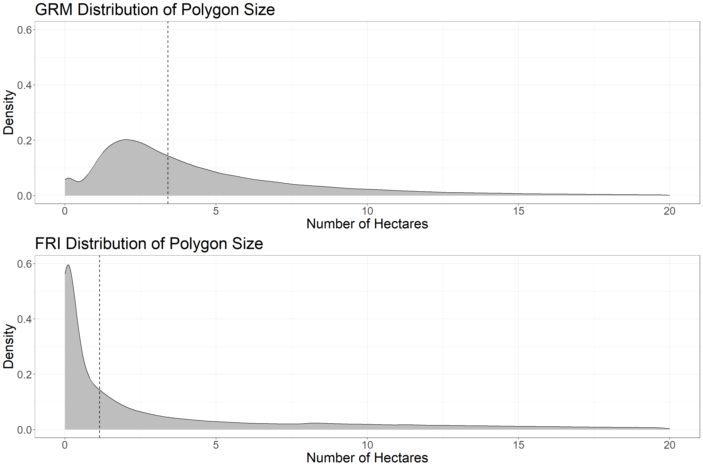
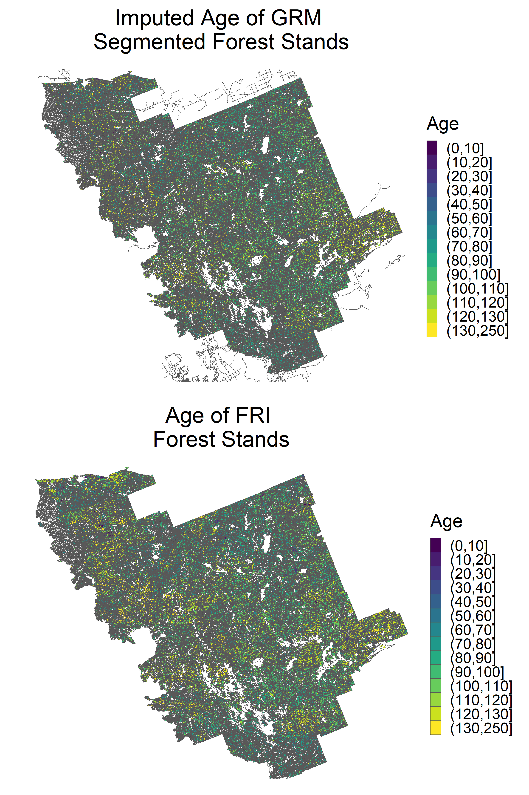
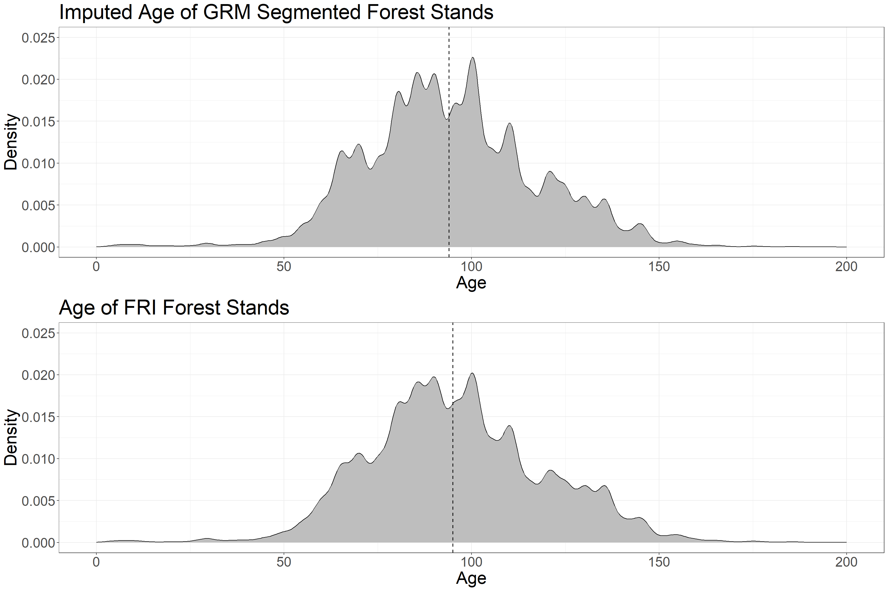
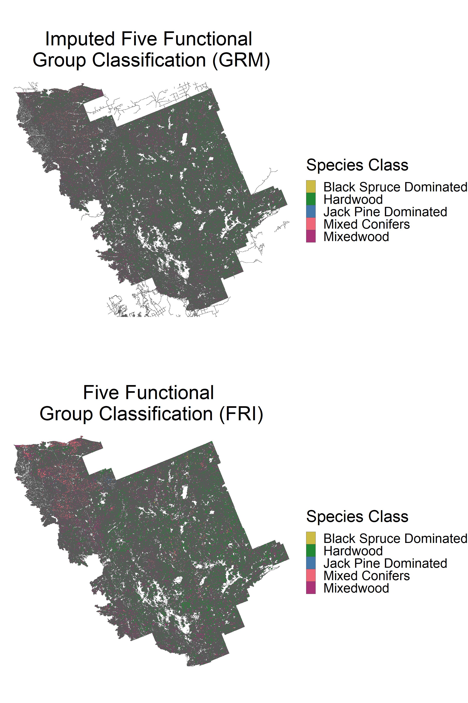
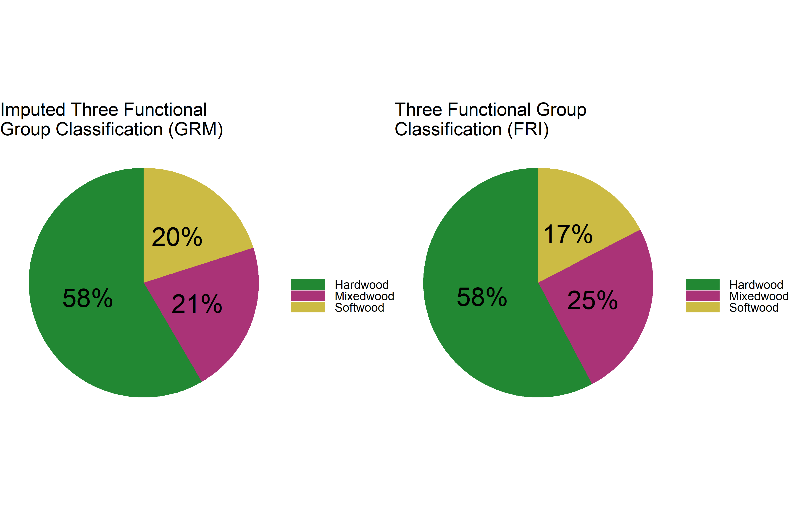

# **6** Case Study: French-Severn Forest {-#fsf}

Now that we have walked through the segmentation and imputation processes, we can do an additional case study by applying the same algorithms and code to the French-Severn Forest in the Great Lakes region of Ontario. Instead of separating the code into distinct sections, we will run the entire segmentation and imputation codes as single chunks and present results.

## **6.1** Segmentation {-#fsf61}

### **6.1.1** Run Algorithm {-#fsf611}


```r
##################################
### INSTALL PACKAGES IF NEEDED ###
##################################

# install.packages(c('terra',
#                    'tidyverse',
#                    'exactextractr',
#                    'sf',
#                    'janitor',
#                    'berryFunctions',
#                    'lwgeom',
#                    'magrittr',
#                    'gridExtra',
#                    'knitr'))

# make sure to have OTB installed from here:
# https://www.orfeo-toolbox.org/

#####################
### LOAD PACKAGES ###
#####################

# load packages
library(terra)
library(tidyverse)
library(exactextractr)
library(sf)
library(janitor)
library(berryFunctions)
library(lwgeom)
library(magrittr)
library(gridExtra)
library(knitr)

####################################
### SET CODE AND FILE PARAMETERS ###
####################################

# set file names for ALS input variables
# these should be gridded raster data with the same CRS and extent
# p95 = 95th percentile of returns height > 1.3 m
# cc = canopy cover (% of firest returns > 2 m)
# cv = coefficient of variation of returns height > 1.3 m
p95_f <- 'D:/ontario_inventory/FSF/ALS/zq95.img'
cc_f <- 'D:/ontario_inventory/FSF/ALS/cov_2m.img'
cv_f <- 'D:/ontario_inventory/FSF/ALS/cv.img'

# set file location of roads shape file (spatial lines)
# roads will be polygonized, masked from segmentation
# and re-added to final dataset as polygons
roads_f <-
  'D:/ontario_inventory/FSF/roads/FS_roads.shp'

# set file location of FRI polygons shape file
# FRI POLYTYPE should have a "WAT" classification to mask water polygons
fri <- 'D:/ontario_inventory/FSF/FRI/FSF_opi_polygon_CSRS_NAD83_17.shp'

# set output folder for files generated
# make sure no "/" at end of folder location!
out_dir <- 'C:/Users/bermane/Desktop/FSF'

# set folder location of OTB (where you installed OTB earlier)
otb_dir <- "C:/OTB/bin"

# set GRM segmentation parameters
# the default are listed below
# refer to paper or OTB GRM webpage for description of parameters
thresh <- "10"
spec <- "0.1"
spat <- "0.5"

# set file location of 2018 VLCE 2.0 landcover data
# using 2018 because it is the year of Romeo ALS acquisition
# can change based on ALS acquisition year
# download here:
# https://opendata.nfis.org/mapserver/nfis-change_eng.html
lc_f <- 'D:/ontario_inventory/VLCE/CA_forest_VLCE2_2018.tif'

###################################################
### LOAD MULTI BAND ALS RASTER FOR SEGMENTATION ###
###################################################

# stack rasters
spl <- rast(c(p95_f, cc_f, cv_f))

# apply smoothing function on 5 cell square
spl[[1]] <- focal(spl[[1]], w = 5, fun = "mean")
spl[[2]] <- focal(spl[[2]], w = 5, fun = "mean")
spl[[3]] <- focal(spl[[3]], w = 5, fun = "mean")

# create ALS template with all values equal to 1
spl_temp <- spl[[1]]
spl_temp[] <- 1

##################
### MASK ROADS ###
##################

# load roads layer
roads <- vect(roads_f)

# reproject to match lidar
roads <- project(roads, spl)

# create roads polygon
spl_r <- mask(spl_temp, roads, touches = T)
npix <- sum(values(spl_r), na.rm = T)
spl_r <- as.polygons(spl_r)
names(spl_r) <- 'POLYTYPE'
spl_r$POLYTYPE <- 'RDS'
spl_r$nbPixels <- npix

# mask road pixels to NA
spl <- spl %>%
  mask(., roads, inverse = T, touches = T)

###########################
### MASK WATER POLYGONS ###
###########################

# water polygons from the FRI are masked and re-added after segmentation

# load photo interpreted polygons
poly <- vect(fri)

# subset polygons that are WAT
poly_sub <- poly[poly$POLYTYPE %in% c('WAT')]

# reproject to match lidar
poly_sub <- project(poly_sub, spl)

# loop through water polygons, mask raster, and vectorize
for (i in 1:length(poly_sub)) {
  pt <- poly_sub$POLYTYPE[i]
  if (i == 1) {
    spl_pt <- spl_temp %>% crop(poly_sub[i], snap = 'out') %>%
      mask(poly_sub[i], touches = T)
    npix <- sum(values(spl_pt), na.rm = T)
    spl_pt <- as.polygons(spl_pt)
    names(spl_pt) <- 'POLYTYPE'
    spl_pt$POLYTYPE <- pt
    spl_pt$nbPixels <- npix
  } else{
    if (is.error(spl_temp %>% crop(poly_sub[i], snap = 'out') %>%
                 mask(poly_sub[i], touches = T)) == F) {
      spl_hold <- spl_temp %>% crop(poly_sub[i], snap = 'out') %>%
        mask(poly_sub[i], touches = T)
      npix <- sum(values(spl_hold), na.rm = T)
      spl_hold <- as.polygons(spl_hold)
      names(spl_hold) <- 'POLYTYPE'
      spl_hold$POLYTYPE <- pt
      spl_hold$nbPixels <- npix
      spl_pt <- rbind(spl_pt, spl_hold)
    }
  }
}

# reproject whole FRI to match lidar
poly <- project(poly, spl)

# mask lidar outside of FRI
spl <- mask(spl, poly, inverse = F, touches = T)

# mask WAT polygons
spl <- mask(spl, poly_sub, inverse = T, touches = T)

###############################################
### COMBINE ROAD AND WATER POLYGON DATASETS ###
###############################################

spl_pt <- rbind(spl_pt, spl_r)

##########################################
### DEAL WITH MISSING DATA AND RESCALE ###
##########################################

# if any band is missing values set all to NA
spl[is.na(spl[[1]])] <- NA
spl[is.na(spl[[2]])] <- NA
spl[is.na(spl[[3]])] <- NA

# create function to rescale values from 0 to 100 using 1 and 99 percentile
scale_100 <- function(x) {
  # calculate 1st and 99th percentile of input raster
  perc <-
    values(x, mat = F) %>% quantile(., probs = c(0.01, 0.99), na.rm = T)
  
  # rescale raster using 1st and 99th %
  x <- (x - perc[1]) / (perc[2] - perc[1]) * 100
  
  #reset values below 0 and above 100
  x[x < 0] <- 0
  x[x > 100] <- 100
  
  return(x)
}

# rescale rasters from 0 to 100
spl[[1]] <- scale_100(spl[[1]])
spl[[2]] <- scale_100(spl[[2]])
spl[[3]] <- scale_100(spl[[3]])

# check if main dir exists and create
if (dir.exists(out_dir) == F) {
  dir.create(out_dir)
}

# check if temp dir exists and create
if (dir.exists(file.path(out_dir, 'temp')) == F) {
  dir.create(file.path(out_dir, 'temp'))
}

# write raster to tif
writeRaster(spl,
            filename = str_c(out_dir, '/temp/spl_stack.tif'),
            overwrite = T)

# write spl_pt
writeVector(spl_pt,
            str_c(out_dir, '/temp/water_roads_polygons.shp'),
            overwrite = T)

# SET PARAMETERS
rast_in <- str_c(out_dir, '/temp/spl_stack.tif')
out_p <- str_c(out_dir, '/temp')
name_out <- str_c(
  'grm_',
  thresh,
  '_',
  gsub(".", "", spec, fixed = TRUE),
  '_',
  gsub(".", "", spat, fixed = TRUE)
)

# create function to run generic region merging
grm_otb <-
  function(otb_path = "",
           raster_in = "",
           out_path = "",
           name = "",
           method = "bs",
           thresh = "",
           spec = "0.5",
           spat = "0.5") {
    # Set configuration
    conf <-
      paste(
        "-in",
        raster_in,
        "-out",
        paste(out_path, "/", name, ".tif", sep = ""),
        "-criterion",
        method,
        "-threshold",
        thresh,
        "-cw",
        spec,
        "-sw",
        spat
      )
    
    # apply function in command line
    system(paste(otb_path, "/otbcli_GenericRegionMerging", " ", conf, sep =
                   ""))
    
    # save configuration for further use
    write.table(
      x = conf,
      file = paste(out_path, "/", name, "_conf.txt", sep = ""),
      row.names = F,
      col.names = F
    )
  }

# run grm
grm_otb(
  otb_path = otb_dir,
  raster_in = rast_in,
  out_path = out_p,
  name = name_out,
  thresh = thresh,
  spec = spec,
  spat = spat
)

###########################
### MASK MISSING VALUES ###
###########################

# load grm raster
p <- rast(str_c(out_p, "/", name_out, ".tif"))

# load seg raster
mask <- rast(rast_in) %>% .[[1]]

# mask grm raster
p <- mask(p, mask)

# write grm raster
writeRaster(p, paste(out_p, "/", name_out, ".tif", sep = ""),
            overwrite = T)

# convert to vector based on cell value
vec <- as.polygons(p)

# create table of number of pixels in each polygon
num <- as.vector(values(p))
num_pix <- tabyl(num)

# drop na row
num_pix <- na.omit(num_pix)

# get pixel ids from vector
vec_dat <- tibble(id = values(vec)[, 1])
colnames(vec_dat) <- 'id'

# loop through values and add to vector data
vec_dat$nbPixels <- NA
for (i in 1:NROW(vec_dat)) {
  vec_dat$nbPixels[i] <- num_pix$n[num_pix$num == vec_dat$id[i]]
}

# remove current column of data and add id
# add nbPixels to vector
vec <- vec[, -1]
vec$id <- vec_dat$id
vec$nbPixels <- vec_dat$nbPixels

##################################
### ADD PRE-ALLOCATED POLYGONS ###
##################################

# load polygon dataset
p <- vec

# reproject segmented polygons to ensure same crs
p <- project(p, spl_pt)

# add non-FOR POLYTYPE polygons back in
p2 <- rbind(p, spl_pt)

#####################
### ADD LANDCOVER ###
#####################

# load VLCE 2.0 landcover dataset
lc <- rast(lc_f)

# project polygons to CRS of raster
p_lc <- project(p2, lc)

# crop raster
lc <- crop(lc, p_lc)

# convert to sf
p_lcsf <- st_as_sf(p_lc)

# extract landcover values
lc_vals <- exact_extract(lc, p_lcsf)

# set landcover class key
lc_key <- c(`0` = 'NA',
            `20` = 'Water',
            `31` = 'Snow/Ice',
            `32` = 'Rock/Rubble',
            `33` = 'Exposed/Barren Land',
            `40` = 'Bryoids',
            `50` = 'Shrubland',
            `80` = 'Wetland',
            `81` = 'Wetland-Treed',
            `100` = 'Herbs',
            `210` = 'Coniferous',
            `220` = 'Broadleaf',
            `230` = 'Mixed Wood')

# find dominant lc type in each polygon
# if there are multiple modes keep them
# apply over list
lc_mode <- sapply(lc_vals, function(x){
  x$value <- recode(x$value, !!!lc_key)
  x <- x %>% group_by(value) %>% summarize(sum = sum(coverage_fraction))
  m <- x$value[which(x$sum == max(x$sum))]
  # m <- get_mode2(x$value[x$coverage_fraction >= cov_frac])
  return(paste(m, collapse = " "))
})

# add to polygon dataset
p2$dom_lc <- lc_mode

# set landcover class key with single forested class
lc_key_for <- c(`0` = 'NA',
                `20` = 'Water',
                `31` = 'Snow/Ice',
                `32` = 'Rock/Rubble',
                `33` = 'Exposed/Barren Land',
                `40` = 'Bryoids',
                `50` = 'Shrubland',
                `80` = 'Wetland',
                `81` = 'Forest',
                `100` = 'Herbs',
                `210` = 'Forest',
                `220` = 'Forest',
                `230` = 'Forest')

# find pixels with forest at least 50% of pixel
# apply over list
lc_dom_for <- sapply(lc_vals, function(x){
  x$value <- recode(x$value, !!!lc_key_for)
  x <- x %>% group_by(value) %>% summarize(sum = sum(coverage_fraction))
  m <- x$value[which(x$sum == max(x$sum))]
  if((length(m) == 1) & (m == 'Forest')[1]){
    if(x$sum[x$value == m]/sum(x$sum) >= 0.5){
      return('Yes')
    }else{return('No')}
  }else{return('No')}
})

# add to polygon dataset
p2$dom_for <- lc_dom_for

##############################
### ADD AREA AND PERIMETER ###
##############################

# convert to sf
p2_sf <- st_as_sf(p2)

# calculate perimeter
p2$perim <- st_perimeter(p2_sf) %>% as.numeric

# calculate area
p2$area <- st_area(p2_sf) %>% as.numeric

# write to file
writeVector(p2, str_c(out_dir, "/", name_out, ".shp"),
            overwrite = T)

###########################################
### EXTRACT FINAL POLYGON SUMMARY STATS ###
###########################################

# create list of polygon files, names and parameters
file <- str_c(out_dir, "/", name_out, ".shp")
out_loc <- out_dir
grm_input <- str_c(out_dir, '/temp/spl_stack.tif')
name <- name_out

# create standard error function
se <- function(x)
  sd(x) / sqrt(length(x))

# load file
p <- vect(file)

# convert to sf
p_sf <- st_as_sf(p)

# subset non masked WAT and RD polygons
p2_sf <- p[is.na(p$POLYTYPE)] %>% st_as_sf
p2 <- p[is.na(p$POLYTYPE)] %>% as.data.frame

# calculate perimeter to area ratio
p2$p_to_a <- p2$perim / p2$area
p2$p_to_a <- round(p2$p_to_a, 3)

# calculate msi
p2$msi <- p2$perim / sqrt(pi * p2$area)

# load original raster input file
ras <- rast(grm_input)

# rename bands
names(ras) <- c('p95', 'cc', 'cv')

# extract pixel values
pvals <- exact_extract(ras, p2_sf)

# calculate SSE
sse <- sapply(
  pvals,
  FUN = function(x) {
    p95_mean <- mean(x$p95, na.rm = T)
    cc_mean <- mean(x$cc, na.rm = T)
    cv_mean <- mean(x$cv, na.rm = T)
    
    return(c(sum((x$p95 - p95_mean) ^ 2, na.rm = T),
             sum((x$cc - cc_mean) ^ 2, na.rm = T),
             sum((x$cv - cv_mean) ^ 2, na.rm = T)))
  }
)

# transpose
sse <- t(sse)

# calculate final sums
sse <- colSums(sse)

# unlist values
pvals2 <- do.call(rbind, pvals)

# calculate global mean values
p95_mean <- mean(pvals2$p95, na.rm = T)
cc_mean <- mean(pvals2$cc, na.rm = T)
cv_mean <- mean(pvals2$cv, na.rm = T)

rm(pvals2)

# calculate SST
sst <- sapply(
  pvals,
  FUN = function(x) {
    return(c(sum((x$p95 - p95_mean) ^ 2, na.rm = T),
             sum((x$cc - cc_mean) ^ 2, na.rm = T),
             sum((x$cv - cv_mean) ^ 2, na.rm = T)))
  }
)

# transpose
sst <- t(sst)

# calculate final sums
sst <- colSums(sst)

# calculate r2 values
r2_p95 <- 1 - (sse[1] / sst[1]) %>% round(3)
r2_cc <- 1 - (sse[2] / sst[2]) %>% round(3)
r2_cv <- 1 - (sse[3] / sst[3]) %>% round(3)
r2_all <- (sum(r2_p95, r2_cc, r2_cv) / 3) %>% round(3)

# create dataframe with values wanted
df <- data.frame(
  alg = name,
  min_pix = (min(p2$nbPixels)),
  max_pix = (max(p2$nbPixels)),
  mean_pix = (mean(p2$nbPixels)),
  med_pix = (median(p2$nbPixels)),
  num_poly = NROW(p2),
  mean_area = mean(p2$area),
  se_area = se(p2$area),
  sd_area = sd(p2$area),
  mean_perim = mean(p2$perim),
  se_perim = se(p2$perim),
  sd_perim = sd(p2$perim),
  mean_p_a = mean(p2$p_to_a),
  se_p_a = se(p2$p_to_a),
  sd_p_a = sd(p2$p_to_a),
  mean_msi = mean(p2$msi),
  se_msi = se(p2$msi),
  sd_msi = sd(p2$msi),
  r2_p95 = r2_p95,
  r2_cc = r2_cc,
  r2_cv = r2_cv,
  r2_all = r2_all
)

# round numeric columns
df %<>%
  mutate_at(c(
    'min_pix',
    'max_pix',
    'mean_pix',
    'med_pix',
    'mean_area',
    'se_area',
    'sd_area',
    'mean_perim',
    'se_perim',
    'sd_perim'
  ),
  function(x)
    round(x, 2)) %>%
  mutate_at(c('mean_p_a',
              'se_p_a',
              'sd_p_a',
              'mean_msi',
              'se_msi',
              'sd_msi'),
            function(x)
              round(x, 4))

#####################
### ADD FRI STATS ###
#####################

# load interpreter derived polygons to extract statistics
pfri <- vect(fri)

# convert to sf
pfri_sf <- st_as_sf(pfri)

# calculate perimeter
pfri$perim <- st_perimeter(pfri_sf) %>% as.numeric

# calculate area
pfri$area <- st_area(pfri_sf) %>% as.numeric

# calculate nbPixels
pfri$nbPixels <- pfri$area / 400

# calculate perimeter to area ratio
pfri$p_to_a <- pfri$perim / pfri$area
pfri$p_to_a <- round(pfri$p_to_a, 3)

# subset all non water/ucl polygons
p2fri_sf <- pfri[!(pfri$POLYTYPE %in% c('WAT', 'UCL'))] %>% st_as_sf
p2fri <- pfri[!(pfri$POLYTYPE %in% c('WAT', 'UCL'))] %>% as.data.frame

# calculate msi
p2fri$msi <- p2fri$perim / sqrt(pi * p2fri$area)

# load original raster input file
ras <- rast(grm_input)

# rename bands
names(ras) <- c('p95', 'cc', 'cv')

# extract pixel values
pvals <- exact_extract(ras, p2fri_sf)

# calculate SSE
sse <- sapply(
  pvals,
  FUN = function(x) {
    # subset values based on coverage fraction
    x %<>% filter(coverage_fraction >= 0.5)
    
    p95_mean <- mean(x$p95, na.rm = T)
    cc_mean <- mean(x$cc, na.rm = T)
    cv_mean <- mean(x$cv, na.rm = T)
    
    return(c(sum((x$p95 - p95_mean) ^ 2, na.rm = T),
             sum((x$cc - cc_mean) ^ 2, na.rm = T),
             sum((x$cv - cv_mean) ^ 2, na.rm = T)))
  }
)

# transpose
sse <- t(sse)

# calculate final sums
sse <- colSums(sse)

# unlist values
pvals2 <- do.call(rbind, pvals)

# subset values based on coverage fraction
pvals2 %<>% filter(coverage_fraction >= 0.5)

# calculate global mean values
p95_mean <- mean(pvals2$p95, na.rm = T)
cc_mean <- mean(pvals2$cc, na.rm = T)
cv_mean <- mean(pvals2$cv, na.rm = T)

rm(pvals2)

# calculate SST
sst <- sapply(
  pvals,
  FUN = function(x) {
    # subset values based on coverage fraction
    x %<>% filter(coverage_fraction >= 0.5)
    
    return(c(sum((x$p95 - p95_mean) ^ 2, na.rm = T),
             sum((x$cc - cc_mean) ^ 2, na.rm = T),
             sum((x$cv - cv_mean) ^ 2, na.rm = T)))
  }
)

# transpose
sst <- t(sst)

# calculate final sums
sst <- colSums(sst)

# calculate r2 values
r2_p95 <- 1 - (sse[1] / sst[1]) %>% round(3)
r2_cc <- 1 - (sse[2] / sst[2]) %>% round(3)
r2_cv <- 1 - (sse[3] / sst[3]) %>% round(3)
r2_all <- (sum(r2_p95, r2_cc, r2_cv) / 3) %>% round(3)

# create dataframe with values wanted
ms_df <- data.frame(
  alg = 'FRI',
  min_pix = (min(p2fri$area / 400)),
  max_pix = (max(p2fri$area / 400)),
  mean_pix = (mean(p2fri$area / 400)),
  med_pix = (median(p2fri$area / 400)),
  num_poly = NROW(p2fri),
  mean_area = mean(p2fri$area),
  se_area = se(p2fri$area),
  sd_area = sd(p2fri$area),
  mean_perim = mean(p2fri$perim),
  se_perim = se(p2fri$perim),
  sd_perim = sd(p2fri$perim),
  mean_p_a = mean(p2fri$p_to_a),
  se_p_a = se(p2fri$p_to_a),
  sd_p_a = sd(p2fri$p_to_a),
  mean_msi = mean(p2fri$msi),
  se_msi = se(p2fri$msi),
  sd_msi = sd(p2fri$msi),
  r2_p95 = r2_p95,
  r2_cc = r2_cc,
  r2_cv = r2_cv,
  r2_all = r2_all
)

# round numeric columns
ms_df %<>%
  mutate_at(c('min_pix',
              'max_pix',
              'mean_pix',
              'med_pix'),
            function(x)
              round(x)) %>%
  mutate_at(c(
    'mean_area',
    'se_area',
    'sd_area',
    'mean_perim',
    'se_perim',
    'sd_perim'
  ),
  function(x)
    round(x, 2)) %>%
  mutate_at(c('mean_p_a',
              'se_p_a',
              'sd_p_a',
              'mean_msi',
              'se_msi',
              'sd_msi'),
            function(x)
              round(x, 4))

# bind df
df <- rbind(df, ms_df)

# write df as csv
write.csv(df,
          file = str_c(out_loc, '/summary_stats.csv'),
          row.names = F)
```

### **6.1.2** Results: Summary Statistics {-#fsf612}

Polygon size statistics:


```r
###########################################
### Summary Stats and Additional Tables ###
###########################################

# Size
t1 <- as_tibble(df[, 1:6])

# change to ha
t1[, 2:5] <- round(t1[, 2:5] / 25, 2)

names(t1) <- c('Dataset', "Min Ha", 'Max Ha', "Mean Ha",
               "Median Ha", "Number of Polygons")
knitr::kable(t1, caption = "Table 1: Polygon Size Stats", label = NA)
```


Table: Table 1: Polygon Size Stats

|Dataset      | Min Ha| Max Ha| Mean Ha| Median Ha| Number of Polygons|
|:------------|------:|------:|-------:|---------:|------------------:|
|grm_10_01_05 |   0.04|  60.00|    4.71|      3.40|             223321|
|FRI          |   0.00| 821.08|    5.24|      1.16|             207121|

The FSF is much larger than the RMF, with over twice as many polygons. The mean polygon size is around ~5 Ha for both the GRM polygons and the FRI, but the median polygon size is much smaller in the FRI. This tells us that in the FSF FRI there are more small polygons, but also a number of polygons with a large size, compared to GRM segmentation.

Area and perimeter:


```r
# Area and Perim
t2 <- as_tibble(df[, c(1, 7:12)])

# change area to Ha
t2[,2:4] <- round(t2[,2:4] / 10000, 2)

names(t2) <- c("Dataset", "Mean Area (Ha)", "SE Area", "SD Area",
               "Mean Perimeter (m)", "SE Perimeter", "SD Perimeter")
knitr::kable(t2, caption = "Table 2: Polygon Area and Perimeter Stats", label = NA)
```


Table: Table 2: Polygon Area and Perimeter Stats

|Dataset      | Mean Area (Ha)| SE Area| SD Area| Mean Perimeter (m)| SE Perimeter| SD Perimeter|
|:------------|--------------:|-------:|-------:|------------------:|------------:|------------:|
|grm_10_01_05 |           4.71|    0.01|    4.27|            1155.00|         1.09|       517.22|
|FRI          |           5.25|    0.02|   10.49|            1257.18|         3.78|      1719.51|

GRM mean area and perimeter are smaller than the FRI, with less variability.

Shape index:


```r
# Mean Shape Index
t3 <- as_tibble(df[, c(1, 16:18)])
names(t3) <- c("Dataset", "Mean Shape Index", "SE Shape Index", "SD Shape Index")
knitr::kable(t3, caption = "Table 3: Polygon Shape Index Stats", label = NA)
```


Table: Table 3: Polygon Shape Index Stats

|Dataset      | Mean Shape Index| SE Shape Index| SD Shape Index|
|:------------|----------------:|--------------:|--------------:|
|grm_10_01_05 |           3.3014|         0.0015|         0.6915|
|FRI          |           4.1344|         0.0035|         1.6105|

GRM polygons are more compact.

R2:


```r
# R2
t4 <- as_tibble(df[,c(1, 19:22)])

# round
t4[,2:5] <- round(t4[,2:5], 2)

names(t4) <- c('Dataset', 'R2 P95', 'R2 Can Cov', 'R2 Coeff Var', 'R2 Overall')
knitr::kable(t4, caption = "Table 4: Polygon R2 Stats", label = NA)
```


Table: Table 4: Polygon R2 Stats

|Dataset      | R2 P95| R2 Can Cov| R2 Coeff Var| R2 Overall|
|:------------|------:|----------:|------------:|----------:|
|grm_10_01_05 |   0.88|       0.90|         0.88|       0.88|
|FRI          |   0.82|       0.82|         0.77|       0.80|

GRM polygons have an overall R2 value of 0.88 compared to 0.80 from the FRI.

### **6.1.3** Results: Distribution Plots {-#fsf613}

Polygon size:


```r
# plot density GRM in ha
g1 <- ggplot(data.frame(nbPixels = p2$nbPixels / 25), aes(x = nbPixels)) +
  geom_density(fill = 'grey') +
  xlim(c(0, 500/25)) +
  ylim(c(0, 0.60)) +
  geom_vline(aes(xintercept = median(nbPixels)),
             linetype = "dashed",
             linewidth = 0.6) +
  theme_bw() +
  xlab('Number of Hectares') +
  ylab('Density') +
  ggtitle('GRM Distribution of Polygon Size') +
  theme(text = element_text(size = 25))

# plot density FRI in ha
g2 <- ggplot(data.frame(nbPixels = p2fri$nbPixels / 25), aes(x = nbPixels)) +
  geom_density(fill = 'grey') +
  xlim(c(0, 500/25)) +
  ylim(c(0, 0.60)) +
  geom_vline(aes(xintercept = median(nbPixels)),
             linetype = "dashed",
             linewidth = 0.6) +
  theme_bw() +
  xlab('Number of Hectares') +
  ylab('Density') +
  ggtitle('FRI Distribution of Polygon Size') +
  theme(text = element_text(size = 25))

# plot together
grid.arrange(g1, g2)
```



The density plots of polygon size give us a good indication of how the datasets differ. GRM polygons have a much larger density of polygons in the ~2-6 Ha range, whereas the FRI has a large number of small polygons, and also a fatter tail of ~10-20 Ha polygons.

Shape index:


```r
# plot shape index GRM
g1 <- ggplot(data.frame(msi = as.numeric(p2$msi)), aes(x = msi)) +
  geom_density(fill = 'grey') +
  xlim(c(0, 8)) +
  ylim(c(0, 1.5)) +
  geom_vline(aes(xintercept = median(msi)),
             linetype = "dashed",
             linewidth = 0.6) +
  theme_bw() +
  xlab('Shape Index') +
  ylab('Density') +
  ggtitle('GRM Distribution of Shape Index') +
  theme(text = element_text(size = 25))

# plot shape index FRI
g2 <- ggplot(data.frame(msi = as.numeric(p2fri$msi)), aes(x = msi)) +
  geom_density(fill = 'grey') +
  xlim(c(0, 8)) +
  ylim(c(0, 1.5)) +
  geom_vline(aes(xintercept = median(msi)),
             linetype = "dashed",
             linewidth = 0.6) +
  theme_bw() +
  xlab('Shape Index') +
  ylab('Density') +
  ggtitle('FRI Distribution of Shape Index') +
  theme(text = element_text(size = 25))

# plot together
grid.arrange(g1, g2)
```


We can see the distribution of polygon shape is more compact among GRM polygons. Remember that we are using the same GRM algorithm parameters as were used in segmenting the RMF. These parameters can be manipulated to meet the needs of various forested areas with different forest characteristics.

## **6.2** Imputation Over FRI {-#fsf62}

### **6.2.1** Run Algorithm {-#fsf621}


```r
##################################
### INSTALL PACKAGES IF NEEDED ###
##################################

# install.packages(c('terra',
#                    'tidyverse',
#                    'exactextractr',
#                    'sf',
#                    'magrittr',
#                    'gridExtra',
#                    'RANN',
#                    'reshape2',
#                    'viridis',
#                    'scales',
#                    'janitor',
#                    'kableExtra',
#                    'knitr'))

# make sure to have OTB installed from here:
# https://www.orfeo-toolbox.org/

#####################
### LOAD PACKAGES ###
#####################

# load packages
library(terra)
library(tidyverse)
library(exactextractr)
library(sf)
library(magrittr)
library(gridExtra)
library(RANN)
library(reshape2)
library(viridis)
library(scales)
library(janitor)
library(kableExtra)
library(knitr)

####################################
### SET CODE AND FILE PARAMETERS ###
####################################

# set file names for ALS input variables

# first set the imputation X-variables
lidar_imp <- c('agb' = 'D:/ontario_inventory/FSF/EFI/Biomass.img',
               'gmvwl' = 'D:/ontario_inventory/FSF/EFI/GMV_WL.img',
               'pcum8' = 'D:/ontario_inventory/FSF/ALS/zpcum8.img',
               'ba' = 'D:/ontario_inventory/FSF/EFI/BasalArea.img',
               'b6' = 'D:/ontario_inventory/FSF/sentinel/boa/b6_fsf_2018.tif')

# next set the data screening variables
lidar_scr <- c('p95' = 'D:/ontario_inventory/FSF/ALS/zq95.img',
               'cc' = 'D:/ontario_inventory/FSF/ALS/cov_2m.img')

# set file location of FRI polygons shape file
fri <- 'D:/ontario_inventory/FSF/FRI/FSF_opi_polygon_CSRS_NAD83_17.shp'

# set file location of GRM polygons shape file
grm <- 'C:/Users/bermane/Desktop/FSF/grm_10_01_05.shp'

# set output folder for files generated
# make sure no "/" at end of folder location!
out_dir <- 'C:/Users/bermane/Desktop/FSF'

# set file location of 2018 VLCE 2.0 landcover data
# using 2018 because it is the year of Romeo ALS acquisition
# can change based on ALS acquisition year
# download here:
# https://opendata.nfis.org/mapserver/nfis-change_eng.html
lc_f <- 'D:/ontario_inventory/VLCE/CA_forest_VLCE2_2018.tif'

###########################################
### EXTRACT VARIABLES INTO FRI POLYGONS ###
###########################################

# load FRI polygons
poly <- vect(fri)

# convert to df
dat_fri <- as.data.frame(poly)

# cbind centroids to dat
dat_fri <- cbind(dat_fri, centroids(poly) %>% crds)

# combine all LiDAR and aux variables to extract
lidar_vars <- c(lidar_imp, lidar_scr)

# loop through LiDAR attributes to extract values
for (i in seq_along(lidar_vars)) {
  # load LiDAR raster
  lidar_ras <- rast(lidar_vars[i])
  
  # project poly to crs of raster
  poly_ras <- project(poly, lidar_ras)
  
  # convert to sf
  poly_ras <- st_as_sf(poly_ras)
  
  #extract median values
  vec <-
    exact_extract(lidar_ras, poly_ras, 'median')
  
  # aggregate into data frame
  if(i == 1){
    vec_df <- as.data.frame(vec)
  } else{
    vec_df <- cbind(vec_df, as.data.frame(vec))
  }
}

# change column names of extracted attribute data frame
colnames(vec_df) <- names(lidar_vars)

# add LiDAR attributes to FRI polygon data frame
dat_fri <- cbind(dat_fri, vec_df)

# add 2018 age values
dat_fri$AGE2018 <- 2018 - dat_fri$YRORG

# check if main dir exists and create
if (dir.exists(out_dir) == F) {
  dir.create(out_dir)
}

# check if temp dir exists and create
if (dir.exists(file.path(out_dir, 'temp')) == F) {
  dir.create(file.path(out_dir, 'temp'))
}

# save extracted dataframe for fast rebooting
save(dat_fri, file = str_c(out_dir, '/temp/dat_fri_extr.RData'))

# load GRM segmented polygons
poly <- vect(grm)

# reproject to match FRI polygons
poly <- project(poly, vect(fri))

# convert to df
dat_grm <- as.data.frame(poly)

# cbind centroids to dat
dat_grm <- cbind(dat_grm, centroids(poly) %>% crds)

# loop through LiDAR attributes to extract values
for (i in seq_along(lidar_vars)) {
  # load LiDAR raster
  lidar_ras <- rast(lidar_vars[i])
  
  # project poly to crs of raster
  poly_ras <- project(poly, lidar_ras)
  
  # convert to sf
  poly_ras <- st_as_sf(poly_ras)
  
  #extract median values
  vec <-
    exact_extract(lidar_ras, poly_ras, 'median')
  
  # aggregate into data frame
  if(i == 1){
    vec_df <- as.data.frame(vec)
  } else{
    vec_df <- cbind(vec_df, as.data.frame(vec))
  }
}

# change column names of extracted attribute data frame
colnames(vec_df) <- names(lidar_vars)

# add LiDAR attributes to FRI polygon data frame
dat_grm <- cbind(dat_grm, vec_df)

# save extracted dataframe for fast rebooting
save(dat_grm, file = str_c(out_dir, '/temp/dat_grm_extr.RData'))

############################################
### FUNCTIONS FOR SPECIES CLASSIFICATION ###
############################################

# assign species name -- note this list was updated with all species in FSF FRI.
# It may need to be adjusted for other areas

assign_common_name <- function(sp_abbrev) {
  sp_abbrev  <- toupper(sp_abbrev)
  
  dict <- data.frame(SB = "black spruce", 
                     LA = "eastern larch", 
                     BW = "white birch", 
                     BF = "balsam fir", 
                     CE = "cedar", 
                     SW = "white spruce", 
                     PT = "trembling aspen", 
                     PJ = "jack pine", 
                     PO = "poplar", 
                     PB = "balsam poplar", 
                     PR = "red pine", 
                     PW = "white pine", 
                     SX = "spruce", 
                     MR = "red maple", 
                     AB = "black ash", 
                     BY = "yellow birch",
                     OR = 'red oak',
                     CW = 'eastern white cedar',
                     MH = 'hard maple',
                     HE = 'eastern hemlock',
                     BD = 'basswood',
                     CB = 'black cherry',
                     BE = 'american beech',
                     AW = 'white ash',
                     PL = 'largetooth aspen',
                     AG = 'red ash',
                     OW = 'white oak',
                     IW = 'ironwood',
                     OB = 'bur oak',
                     EW = 'white elm',
                     MS = 'silver maple',
                     PS = 'scots pine',
                     OH = 'other hardwoods',
                     BG = 'grey birch',
                     AL = 'alder',
                     SR = 'red spruce',
                     BB = 'blue beech',
                     MT = 'mountain maple',
                     MB = 'black maple',
                     OC = 'other conifers',
                     SN = 'norway spruce',
                     PE = 'silver poplar',
                     HI = 'hickory',
                     AX = 'ash') %>%
    pivot_longer(everything(), names_to = "abb", values_to = "common")
  
  dict$common[match(sp_abbrev, dict$abb)]
  
}

# assign either coniferous or deciduous
assign_type <- function(sp_common) {
  sp_common  <- tolower(sp_common)
  ifelse(stringr::str_detect(sp_common, pattern = "pine|spruce|fir|cedar|larch|conifers|hemlock"), "Coniferous", "Deciduous")
}

####################################
### CALCULATE SPECIES ATTRIBUTES ###
####################################

# load fri
poly_fri <- st_read(fri)

# separate SPCOMP string into individual columns
poly_fri_for <- poly_fri %>%
  st_drop_geometry() %>%
  filter(POLYTYPE == "FOR") %>%
  select(OPI_ID, POLYTYPE, OSPCOMP) %>% # these need to match FRI attr fields
  mutate(new_SP = str_match_all(OSPCOMP, "[A-Z]{2}[ ]+[0-9]+")) %>%
  unnest(new_SP) %>%
  mutate(new_SP = as.character(new_SP)) %>%
  separate(new_SP, into = c("SP", "PROP")) %>%
  mutate(PROP = as.numeric(PROP),
         Common = assign_common_name(SP),
         sp_type = assign_type(Common))

# calculate polygon level species groups
# percent species type
poly_dom_type <- poly_fri_for %>%
  group_by(OPI_ID) %>%
  summarize(per_conif = sum(PROP[sp_type == "Coniferous"]), 
            per_decid = sum(PROP[sp_type == "Deciduous"]))

# leading species
poly_dom_sp <- poly_fri_for %>%
  group_by(OPI_ID) %>%
  slice_max(PROP, n = 1, with_ties = FALSE)

# combine type with leading species
poly_dom_sp_group <- inner_join(poly_dom_type, poly_dom_sp, by = "OPI_ID")

# calculate functional groups
poly_dom_sp_group <- poly_dom_sp_group %>%
  mutate(SpeciesGroup1 = ifelse(PROP >= 70, Common, 
                                ifelse(PROP < 70 & per_conif >= 70, "Mixed Coniferous",
                                       ifelse(PROP < 70 & per_decid >= 70, "Mixed Deciduous", "Mixedwoods"))), 
         SpeciesGroup2 = ifelse(Common == "jack pine" & PROP >= 50 & per_conif >= 70, "Jack Pine Dominated", ifelse(
           Common == "black spruce" & PROP >= 50 & per_conif >= 70, "Black Spruce Dominated", ifelse(
             per_decid >= 70, "Hardwood", ifelse(
               per_decid >= 30 & per_decid <= 70 & per_conif >= 30 & per_conif <= 70, "Mixedwood", "Mixed Conifers"
             )))), 
         SpeciesGroup3 = ifelse(per_conif >= 70, "Softwood", 
                                ifelse(per_decid >= 70, "Hardwood", "Mixedwood"))) %>%
  mutate(across(.cols = starts_with("SpeciesGroup"), .fns = as.factor)) %>%
  select(OPI_ID, SpeciesGroup2, SpeciesGroup3) %>%
  rename(class5 = SpeciesGroup2, class3 = SpeciesGroup3)

# calculate leading and second species only
poly_fri_sp <- poly_fri %>%
  st_drop_geometry() %>%
  filter(POLYTYPE == "FOR") %>%
  select(OPI_ID, POLYTYPE, OSPCOMP) %>% # these need to match FRI attr fields
  mutate(new_SP = str_match_all(OSPCOMP, "[A-Z]{2}[ ]+[0-9]+")) %>%
  unnest_wider(new_SP, names_sep = '') %>%
  rename(new_SP = new_SP1) %>%
  mutate(new_SP = as.character(new_SP),
         new_SP2 = as.character(new_SP2)) %>%
  separate(new_SP, into = c("SP", "PROP")) %>%
  separate(new_SP2, into = c("SP2", "PROP2")) %>%
  select(OPI_ID, SP, SP2)

# join functional groups with leading and second species
poly_dom_sp_group <- left_join(poly_dom_sp_group,
                               poly_fri_sp,
                               by = 'OPI_ID') %>%
  rename(SP1 = SP)

# join to FRI extracted dataframe
dat_fri <- left_join(dat_fri,
                     poly_dom_sp_group,
                     by = 'OPI_ID')

# re-save extracted dataframe for fast rebooting
save(dat_fri, file = str_c(out_dir, '/temp/dat_fri_extr.RData'))

#####################
### LOAD FRI DATA ###
#####################

# load FRI polygons
poly <- vect(fri)

# load FRI polygon data frame
load(str_c(out_dir, '/temp/dat_fri_extr.RData'))

#############################
### DATA SCREENING PART 1 ###
#############################

# remove all non-forested polygons
dat_fri <- filter(dat_fri, POLYTYPE == 'FOR')

# create smaller polygon set only FOR polytypes
poly_fri <- poly[poly$POLYTYPE == 'FOR']

#############################
### DATA SCREENING PART 2 ###
#############################

# polygon landcover > 50% forested

# load VLCE 2.0 landcover dataset from 2018
lc <- rast(lc_f)

# project poly to crs of raster
poly_lc <- project(poly_fri, lc)

# convert to sf
poly_lcsf <- st_as_sf(poly_lc)

# extract landcover values
lc_poly <- exact_extract(lc, poly_lcsf)

# set landcover class key with single forested class
lc_key_for <- c(`0` = 'NA',
                `20` = 'Water',
                `31` = 'Snow/Ice',
                `32` = 'Rock/Rubble',
                `33` = 'Exposed/Barren Land',
                `40` = 'Bryoids',
                `50` = 'Shrubland',
                `80` = 'Wetland',
                `81` = 'Forest',
                `100` = 'Herbs',
                `210` = 'Forest',
                `220` = 'Forest',
                `230` = 'Forest')

# find pixels with forest at least 50% of pixel
# apply over list
lc_dom_for <- sapply(lc_poly, function(x){
  x$value <- recode(x$value, !!!lc_key_for)
  x <- x %>% group_by(value) %>% summarize(sum = sum(coverage_fraction))
  m <- x$value[which(x$sum == max(x$sum))]
  if((length(m) == 1) & (m == 'Forest')[1]){
    if(x$sum[x$value == m]/sum(x$sum) >= 0.5){
      return('Yes')
    }else{return('No')}
  }else{return('No')}
})

# add new columns into dat
dat_fri <- dat_fri %>% add_column(dom_for = lc_dom_for)

# subset FRI data frame based on whether polygon dominated by forest
dat_fri_scr <- dat_fri %>% filter(dom_for == 'Yes')

#############################
### DATA SCREENING PART 3 ###
#############################

# require p95 >= 5
# require cc >= 50
dat_fri_scr %<>% filter(p95 >= 5, cc >= 50)

# save extracted data frame for fast rebooting
save(dat_fri_scr, file = str_c(out_dir, '/temp/dat_fri_scr.RData'))

#####################
### LOAD GRM DATA ###
#####################

# load GRM polygon data frame
load(str_c(out_dir, '/temp/dat_grm_extr.RData'))

######################
### DATA SCREENING ###
######################

# Don't screen GRM polygons for POLYTYPE == FOR

# polygon landcover > 50% forested
# dom_for attribute already exists in GRM data from segmentation

# require p95 >= 5
# require cc >= 50

dat_grm_scr <- dat_grm %>% filter(dom_for == 'Yes',
                                  p95 >= 5,
                                  cc >= 50)

# save extracted data frame for fast rebooting
save(dat_grm_scr, file = str_c(out_dir, '/temp/dat_grm_scr.RData'))

######################################################
### FUNCTIONS TO RUN K NEAREST NEIGHBOR IMPUTATION ###
######################################################

# create mode function
getmode <- function(v) {
  uniqv <- unique(v)
  uniqv[which.max(tabulate(match(v, uniqv)))]
}

# create rmsd function
rmsd <- function(obs, est){
  sqrt(mean((est - obs) ^ 2))
}

# create rrmsd function
rrmsd <- function(obs, est){
  sqrt(mean((est - obs) ^ 2)) / mean(obs) * 100
}

# create mae function
mae <- function(obs, est){
  mean(abs(est - obs))
}

# create mbe function
mbe <- function(obs, est){
  mean(est - obs)
}

# create rmbe function
rmbe <- function(obs, est){
  mean(est - obs) / mean(obs) * 100
}

# create knn function to output performance results
run_knn_fri <- function(dat, vars, k) {
  
  # subset data
  dat_nn <- dat %>% select(all_of(vars))
  
  # scale for nn computation
  dat_nn_scaled <- dat_nn %>% scale
  
  # run nearest neighbor
  nn <- nn2(dat_nn_scaled, dat_nn_scaled, k = k + 1)
  
  # get nn indices
  nni <- nn[[1]][, 2:(k + 1)]
  
  # add vars to tibble
  # take mean/mode if k > 1
  if(k > 1){
    for(i in seq_along(vars)){
      if(i == 1){
        nn_tab <- tibble(!!vars[i] := dat_nn[,i],
                         !!str_c(vars[i], '_nn') := apply(nni, MARGIN = 1, FUN = function(x){
                           mean(dat_nn[x, i])
                         }))
      }else{
        nn_tab %<>% mutate(!!vars[i] := dat_nn[,i],
                           !!str_c(vars[i], '_nn') := apply(nni, MARGIN = 1, FUN = function(x){
                             mean(dat_nn[x, i])
                           }))
      }
    }
    
    # add target vars to tibble
    nn_tab %<>% mutate(age = dat$AGE2018,
                       sp1 = dat$SP1,
                       sp2 = dat$SP2,
                       class5 = dat$class5,
                       class3 = dat$class3,
                       age_nn = apply(nni, MARGIN = 1, FUN = function(x){
                         mean(dat$AGE2018[x])
                       }),
                       sp1_nn = apply(nni, MARGIN = 1, FUN = function(x){
                         getmode(dat$SP1[x])
                       }),
                       sp2_nn = apply(nni, MARGIN = 1, FUN = function(x){
                         getmode(dat$SP2[x])
                       }),
                       class5_nn = apply(nni, MARGIN = 1, FUN = function(x){
                         getmode(dat$class5[x])
                       }),
                       class3_nn = apply(nni, MARGIN = 1, FUN = function(x){
                         getmode(dat$class3[x])
                       }))
  }
  
  # take direct nn if k == 1
  if(k == 1){
    for(i in seq_along(vars)){
      if(i == 1){
        nn_tab <- tibble(!!vars[i] := dat_nn[,i],
                         !!str_c(vars[i], '_nn') := dat_nn[nn[[1]][,2],i])
      }else{
        nn_tab %<>% mutate(!!vars[i] := dat_nn[,i],
                           !!str_c(vars[i], '_nn') := dat_nn[nn[[1]][,2],i])
      }
    }
    
    # add target vars to tibble
    nn_tab %<>% mutate(age = dat$AGE2018,
                       sp1 = dat$SP1,
                       sp2 = dat$SP2,
                       class5 = dat$class5,
                       class3 = dat$class3,
                       age_nn = dat$AGE2018[nn[[1]][,2]],
                       sp1_nn = dat$SP1[nn[[1]][,2]],
                       sp2_nn = dat$SP2[nn[[1]][,2]],
                       class5_nn = dat$class5[nn[[1]][,2]],
                       class3_nn = dat$class3[nn[[1]][,2]])
  }
  
  
  # calculate fit metrics for vars
  for(i in seq_along(vars)){
    if(i == 1){
      perform_df <- tibble(variable = vars[i],
                           metric = c('rrmsd (%)', 'rmbe (%)'),
                           value = c(rrmsd(pull(nn_tab, vars[i]),
                                  pull(nn_tab, str_c(vars[i], '_nn'))),
                                  rmbe(pull(nn_tab, vars[i]),
                                  pull(nn_tab, str_c(vars[i], '_nn')))))
    }else{
      perform_df %<>% add_row(variable = vars[i],
                           metric = c('rrmsd (%)', 'rmbe (%)'),
                           value = c(rrmsd(pull(nn_tab, vars[i]),
                                  pull(nn_tab, str_c(vars[i], '_nn'))),
                                  rmbe(pull(nn_tab, vars[i]),
                                  pull(nn_tab, str_c(vars[i], '_nn')))))
    }
  }
  
  # calculate metrics for age
  perform_df %<>% add_row(variable = 'age',
                          metric = c('rmsd (yrs)', 'mbe (yrs)', 'mae (yrs)'),
                          value = c(rmsd(nn_tab$age, nn_tab$age_nn),
                                    mbe(nn_tab$age, nn_tab$age_nn),
                                    mae(nn_tab$age, nn_tab$age_nn)))
  
  # calculate SP1 accuracy
  # create df of SP1
  sp1 <- data.frame(obs = nn_tab$sp1,
                    est = nn_tab$sp1_nn)
  
  # create column of match or not
  sp1$match <- sp1$obs == sp1$est
  
  # add total percent of matching SP1 to perform_df
  perform_df %<>% add_row(variable = 'leading species',
                          metric = 'accuracy (%)',
                          value = NROW(sp1[sp1$match == T,]) /
                                   NROW(sp1) * 100)
  
  # calculate SP2 accuracy
  # create df of SP2
  sp2 <- data.frame(obs = nn_tab$sp2,
                    est = nn_tab$sp2_nn)
  
  # create column of match or not
  sp2$match <- sp2$obs == sp2$est
  
  # add total percent of matching SP2 to perform_df
  perform_df %<>% add_row(variable = 'second species', 
                        metric = 'accuracy (%)',
                        value = NROW(sp2[sp2$match == T,]) /
                                   NROW(sp2) * 100)
  
  # calculate  class3 accuracy
  # create df of class3
  class3 <- data.frame(obs = nn_tab$class3,
                       est = nn_tab$class3_nn)
  
  # create column of match or not
  class3$match <- class3$obs == class3$est
  
  # add total percent of matching class3 to perform_df
  perform_df %<>% add_row(variable = 'three func group class',
                          metric = 'accuracy (%)',
                          value = NROW(class3[class3$match == T,]) /
                                   NROW(class3) * 100)
  
  # calculate class5 accuracy
  # create df of class5
  class5 <- data.frame(obs = nn_tab$class5,
                       est = nn_tab$class5_nn)
  
  # create column of match or not
  class5$match <- class5$obs == class5$est
  
  # add total percent of matching class5 to perform_df
  perform_df %<>% add_row(variable = 'five func group class',
                        metric = 'accuracy (%)',
                        value = NROW(class5[class5$match == T,]) /
                                   NROW(class5) * 100)
  
  # return df
  return(perform_df)
}

# create knn function to output imputed vs. observed table
run_knn_fri_table <- function(dat, vars, k) {
  
  # subset data
  dat_nn <- dat %>% select(all_of(vars))
  
  # scale for nn computation
  dat_nn_scaled <- dat_nn %>% scale
  
  # run nearest neighbor
  nn <- nn2(dat_nn_scaled, dat_nn_scaled, k = k + 1)
  
  # get nn indices
  nni <- nn[[1]][, 2:(k + 1)]
  
  # add vars to tibble
  # take mean/mode if k > 1
  if(k > 1){
    for(i in seq_along(vars)){
      if(i == 1){
        nn_tab <- tibble(!!vars[i] := dat_nn[,i],
                         !!str_c(vars[i], '_nn') := apply(nni, MARGIN = 1, FUN = function(x){
                           mean(dat_nn[x, i])
                         }))
      }else{
        nn_tab %<>% mutate(!!vars[i] := dat_nn[,i],
                           !!str_c(vars[i], '_nn') := apply(nni, MARGIN = 1, FUN = function(x){
                             mean(dat_nn[x, i])
                           }))
      }
    }
    
    # add target vars to tibble
    nn_tab %<>% mutate(age = dat$AGE2018,
                       sp1 = dat$SP1,
                       sp2 = dat$SP2,
                       class5 = dat$class5,
                       class3 = dat$class3,
                       age_nn = apply(nni, MARGIN = 1, FUN = function(x){
                         mean(dat$AGE2018[x])
                       }),
                       sp1_nn = apply(nni, MARGIN = 1, FUN = function(x){
                         getmode(dat$SP1[x])
                       }),
                       sp2_nn = apply(nni, MARGIN = 1, FUN = function(x){
                         getmode(dat$SP2[x])
                       }),
                       class5_nn = apply(nni, MARGIN = 1, FUN = function(x){
                         getmode(dat$class5[x])
                       }),
                       class3_nn = apply(nni, MARGIN = 1, FUN = function(x){
                         getmode(dat$class3[x])
                       }))
  }
  
  # take direct nn if k == 1
  if(k == 1){
    for(i in seq_along(vars)){
      if(i == 1){
        nn_tab <- tibble(!!vars[i] := dat_nn[,i],
                         !!str_c(vars[i], '_nn') := dat_nn[nn[[1]][,2],i])
      }else{
        nn_tab %<>% mutate(!!vars[i] := dat_nn[,i],
                           !!str_c(vars[i], '_nn') := dat_nn[nn[[1]][,2],i])
      }
    }
    
    # add target vars to tibble
    nn_tab %<>% mutate(age = dat$AGE2018,
                       sp1 = dat$SP1,
                       sp2 = dat$SP2,
                       class5 = dat$class5,
                       class3 = dat$class3,
                       age_nn = dat$AGE2018[nn[[1]][,2]],
                       sp1_nn = dat$SP1[nn[[1]][,2]],
                       sp2_nn = dat$SP2[nn[[1]][,2]],
                       class5_nn = dat$class5[nn[[1]][,2]],
                       class3_nn = dat$class3[nn[[1]][,2]])
  }
  
  # return nn table
  return(nn_tab)
}

########################################################
### RUN KNN IMPUTATION USING OPTIMAL MODEL VARIABLES ###
########################################################

# load FRI screened polygons
load(str_c(out_dir, '/temp/dat_fri_scr.RData'))

# subset only the attributes we need from the screened FRI polygons
dat_fri_scr %<>% select(OPI_ID, AGE2018, agb,
                        gmvwl, pcum8, ba,
                        b6, x, y, SP1, SP2, class3, class5)

# remove any polygons with missing values
# in imputation X-variables
dat_fri_scr <- left_join(dat_fri_scr %>% select(OPI_ID, AGE2018, agb,
                        gmvwl, pcum8, ba,
                        b6, x, y) %>% na.omit,
                        dat_fri_scr)

# create vector of X-variables for imputation
vars <- c('agb', 'gmvwl',
          'pcum8', 'ba',
          'b6', 'x', 'y')

# run_knn_fri function to get performance results
perf <- run_knn_fri(dat_fri_scr, vars, k = 5)

# run_knn_fri function to get imputed vs. observed values
nn_tab <- run_knn_fri_table(dat_fri_scr, vars, k = 5)
```

### **6.2.2** Results: Imputation Over FRI {-#fsf622}

Summary Stats:


```r
# round values
perf %<>% mutate(value = round(value, 2))

# factor variable and metric categories to order
perf %<>% mutate(variable = factor(variable, levels = c('age', 'leading species', 
                                                        'second species', 'three func group class',
                                                        'five func group class', vars))) %>%
  mutate(metric = factor(metric, levels = c('rmsd (yrs)', 'mbe (yrs)', 'mae (yrs)', 'accuracy (%)', 'rrmsd (%)', 'rmbe (%)')))

# cast df
perf_cast <- dcast(perf, variable ~ metric)

# remove x and y
perf_cast %<>% filter(!(variable %in% c('x', 'y')))

# set NA to blank
perf_cast[is.na(perf_cast)] <- ''

# display results
knitr::kable(perf_cast, caption = "Imputation Performance of FRI Forest Stand Polygons", label = NA)
```

<table>
<caption>Imputation Performance of FRI Forest Stand Polygons</caption>
 <thead>
  <tr>
   <th style="text-align:left;"> variable </th>
   <th style="text-align:left;"> rmsd (yrs) </th>
   <th style="text-align:left;"> mbe (yrs) </th>
   <th style="text-align:left;"> mae (yrs) </th>
   <th style="text-align:left;"> accuracy (%) </th>
   <th style="text-align:left;"> rrmsd (%) </th>
   <th style="text-align:left;"> rmbe (%) </th>
  </tr>
 </thead>
<tbody>
  <tr>
   <td style="text-align:left;"> age </td>
   <td style="text-align:left;"> 20.08 </td>
   <td style="text-align:left;"> 0.17 </td>
   <td style="text-align:left;"> 14.75 </td>
   <td style="text-align:left;">  </td>
   <td style="text-align:left;">  </td>
   <td style="text-align:left;">  </td>
  </tr>
  <tr>
   <td style="text-align:left;"> leading species </td>
   <td style="text-align:left;">  </td>
   <td style="text-align:left;">  </td>
   <td style="text-align:left;">  </td>
   <td style="text-align:left;"> 64.47 </td>
   <td style="text-align:left;">  </td>
   <td style="text-align:left;">  </td>
  </tr>
  <tr>
   <td style="text-align:left;"> second species </td>
   <td style="text-align:left;">  </td>
   <td style="text-align:left;">  </td>
   <td style="text-align:left;">  </td>
   <td style="text-align:left;"> 31.75 </td>
   <td style="text-align:left;">  </td>
   <td style="text-align:left;">  </td>
  </tr>
  <tr>
   <td style="text-align:left;"> three func group class </td>
   <td style="text-align:left;">  </td>
   <td style="text-align:left;">  </td>
   <td style="text-align:left;">  </td>
   <td style="text-align:left;"> 78.61 </td>
   <td style="text-align:left;">  </td>
   <td style="text-align:left;">  </td>
  </tr>
  <tr>
   <td style="text-align:left;"> five func group class </td>
   <td style="text-align:left;">  </td>
   <td style="text-align:left;">  </td>
   <td style="text-align:left;">  </td>
   <td style="text-align:left;"> 80.78 </td>
   <td style="text-align:left;">  </td>
   <td style="text-align:left;">  </td>
  </tr>
  <tr>
   <td style="text-align:left;"> agb </td>
   <td style="text-align:left;">  </td>
   <td style="text-align:left;">  </td>
   <td style="text-align:left;">  </td>
   <td style="text-align:left;">  </td>
   <td style="text-align:left;"> 2.5 </td>
   <td style="text-align:left;"> -0.02 </td>
  </tr>
  <tr>
   <td style="text-align:left;"> gmvwl </td>
   <td style="text-align:left;">  </td>
   <td style="text-align:left;">  </td>
   <td style="text-align:left;">  </td>
   <td style="text-align:left;">  </td>
   <td style="text-align:left;"> 3.84 </td>
   <td style="text-align:left;"> -0.28 </td>
  </tr>
  <tr>
   <td style="text-align:left;"> pcum8 </td>
   <td style="text-align:left;">  </td>
   <td style="text-align:left;">  </td>
   <td style="text-align:left;">  </td>
   <td style="text-align:left;">  </td>
   <td style="text-align:left;"> 1.24 </td>
   <td style="text-align:left;"> 0.07 </td>
  </tr>
  <tr>
   <td style="text-align:left;"> ba </td>
   <td style="text-align:left;">  </td>
   <td style="text-align:left;">  </td>
   <td style="text-align:left;">  </td>
   <td style="text-align:left;">  </td>
   <td style="text-align:left;"> 2.24 </td>
   <td style="text-align:left;"> 0.05 </td>
  </tr>
  <tr>
   <td style="text-align:left;"> b6 </td>
   <td style="text-align:left;">  </td>
   <td style="text-align:left;">  </td>
   <td style="text-align:left;">  </td>
   <td style="text-align:left;">  </td>
   <td style="text-align:left;"> 2.27 </td>
   <td style="text-align:left;"> 0.09 </td>
  </tr>
</tbody>
</table>

The mean bias error (MBE) of age is 0.17 years, indicating the imputed estimates of age are not skewed toward younger or older values. The mean absolute error (MAE) of age is 14.75 years, which is the average difference between the observed and imputed value.

Accuracy of leading species classification is 64.47%, and a much lower 31.75% for second leading species. Three and five functional group classification have respective accuracies of 78.61% and 80.78%. Functional group classification accuracies are higher than in the RMF.

Relative root mean squared difference (RRMSD) of the imputation attributes (avg, sd, rumple, zpcum8, and red_edge_2) is below 4% for all attributes. These are low values, which demonstrate that the imputation algorithm is finding optimal matches within the database of available FRI polygons.

Relative mean bias error (RMBE) of the imputation attributes is less than 1%, meaning that the nearest neighbor selections are not skewed toward positive or negative values of these attributes.

RRMSD/RMBE are not calculated for x and y because the coordinates do not represent a value scale.

We can also generate detailed confusion matrices of the imputed vs. observed species composition.

Confusion matrices:


```r
# calculate 3 func group confusion matrix
# build accuracy table
accmat <- table("pred" = nn_tab$class3_nn, "ref" = nn_tab$class3)

# UA
ua <- diag(accmat) / rowSums(accmat) * 100

# PA
pa <- diag(accmat) / colSums(accmat) * 100

# OA
oa <- sum(diag(accmat)) / sum(accmat) * 100

# build confusion matrix
accmat_ext <- addmargins(accmat)
accmat_ext <- rbind(accmat_ext, "Users" = c(pa, NA))
accmat_ext <- cbind(accmat_ext, "Producers" = c(ua, NA, oa))
accmat_ext <- round(accmat_ext, 2)
dimnames(accmat_ext) <- list("Imputed" = colnames(accmat_ext),
                             "Observed" = rownames(accmat_ext))
class(accmat_ext) <- "table"

# display results
knitr::kable(accmat_ext %>% round, caption = "Confusion matrix of imputed vs. observed three functional group classification over FRI polygons. Rows are imputed values and columns are observed values.", label = NA)
```

<table>
<caption>Confusion matrix of imputed vs. observed three functional group classification over FRI polygons. Rows are imputed values and columns are observed values.</caption>
 <thead>
  <tr>
   <th style="text-align:left;">   </th>
   <th style="text-align:right;"> Hardwood </th>
   <th style="text-align:right;"> Mixedwood </th>
   <th style="text-align:right;"> Softwood </th>
   <th style="text-align:right;"> Sum </th>
   <th style="text-align:right;"> Users </th>
  </tr>
 </thead>
<tbody>
  <tr>
   <td style="text-align:left;"> Hardwood </td>
   <td style="text-align:right;"> 53011 </td>
   <td style="text-align:right;"> 5542 </td>
   <td style="text-align:right;"> 745 </td>
   <td style="text-align:right;"> 59298 </td>
   <td style="text-align:right;"> 89 </td>
  </tr>
  <tr>
   <td style="text-align:left;"> Mixedwood </td>
   <td style="text-align:right;"> 4227 </td>
   <td style="text-align:right;"> 14830 </td>
   <td style="text-align:right;"> 5210 </td>
   <td style="text-align:right;"> 24267 </td>
   <td style="text-align:right;"> 61 </td>
  </tr>
  <tr>
   <td style="text-align:left;"> Softwood </td>
   <td style="text-align:right;"> 1098 </td>
   <td style="text-align:right;"> 4781 </td>
   <td style="text-align:right;"> 11560 </td>
   <td style="text-align:right;"> 17439 </td>
   <td style="text-align:right;"> 66 </td>
  </tr>
  <tr>
   <td style="text-align:left;"> Sum </td>
   <td style="text-align:right;"> 58336 </td>
   <td style="text-align:right;"> 25153 </td>
   <td style="text-align:right;"> 17515 </td>
   <td style="text-align:right;"> 101004 </td>
   <td style="text-align:right;"> NA </td>
  </tr>
  <tr>
   <td style="text-align:left;"> Producers </td>
   <td style="text-align:right;"> 91 </td>
   <td style="text-align:right;"> 59 </td>
   <td style="text-align:right;"> 66 </td>
   <td style="text-align:right;"> NA </td>
   <td style="text-align:right;"> 79 </td>
  </tr>
</tbody>
</table>

```r
# calculate 5 func group confusion matrix
# build accuracy table
accmat <- table("pred" = nn_tab$class5_nn, "ref" = nn_tab$class5)

# UA
ua <- diag(accmat) / rowSums(accmat) * 100

# PA
pa <- diag(accmat) / colSums(accmat) * 100

# OA
oa <- sum(diag(accmat)) / sum(accmat) * 100

# build confusion matrix
accmat_ext <- addmargins(accmat)
accmat_ext <- rbind(accmat_ext, "Users" = c(pa, NA))
accmat_ext <- cbind(accmat_ext, "Producers" = c(ua, NA, oa))
accmat_ext <- round(accmat_ext, 2)
dimnames(accmat_ext) <- list("Imputed" = colnames(accmat_ext),
                             "Observed" = rownames(accmat_ext))
class(accmat_ext) <- "table"

# display results
knitr::kable(accmat_ext %>% round, caption = "Confusion matrix of imputed vs. observed five functional group classification over FRI polygons. Rows are imputed values and columns are observed values.", label = NA)
```

<table>
<caption>Confusion matrix of imputed vs. observed five functional group classification over FRI polygons. Rows are imputed values and columns are observed values.</caption>
 <thead>
  <tr>
   <th style="text-align:left;">   </th>
   <th style="text-align:right;"> Black Spruce Dominated </th>
   <th style="text-align:right;"> Hardwood </th>
   <th style="text-align:right;"> Jack Pine Dominated </th>
   <th style="text-align:right;"> Mixed Conifers </th>
   <th style="text-align:right;"> Mixedwood </th>
   <th style="text-align:right;"> Sum </th>
   <th style="text-align:right;"> Users </th>
  </tr>
 </thead>
<tbody>
  <tr>
   <td style="text-align:left;"> Black Spruce Dominated </td>
   <td style="text-align:right;"> 549 </td>
   <td style="text-align:right;"> 61 </td>
   <td style="text-align:right;"> 3 </td>
   <td style="text-align:right;"> 348 </td>
   <td style="text-align:right;"> 217 </td>
   <td style="text-align:right;"> 1178 </td>
   <td style="text-align:right;"> 47 </td>
  </tr>
  <tr>
   <td style="text-align:left;"> Hardwood </td>
   <td style="text-align:right;"> 44 </td>
   <td style="text-align:right;"> 52851 </td>
   <td style="text-align:right;"> 17 </td>
   <td style="text-align:right;"> 319 </td>
   <td style="text-align:right;"> 5613 </td>
   <td style="text-align:right;"> 58844 </td>
   <td style="text-align:right;"> 90 </td>
  </tr>
  <tr>
   <td style="text-align:left;"> Jack Pine Dominated </td>
   <td style="text-align:right;"> 20 </td>
   <td style="text-align:right;"> 30 </td>
   <td style="text-align:right;"> 357 </td>
   <td style="text-align:right;"> 128 </td>
   <td style="text-align:right;"> 148 </td>
   <td style="text-align:right;"> 683 </td>
   <td style="text-align:right;"> 52 </td>
  </tr>
  <tr>
   <td style="text-align:left;"> Mixed Conifers </td>
   <td style="text-align:right;"> 483 </td>
   <td style="text-align:right;"> 316 </td>
   <td style="text-align:right;"> 104 </td>
   <td style="text-align:right;"> 3607 </td>
   <td style="text-align:right;"> 2248 </td>
   <td style="text-align:right;"> 6758 </td>
   <td style="text-align:right;"> 53 </td>
  </tr>
  <tr>
   <td style="text-align:left;"> Mixedwood </td>
   <td style="text-align:right;"> 336 </td>
   <td style="text-align:right;"> 5078 </td>
   <td style="text-align:right;"> 159 </td>
   <td style="text-align:right;"> 3739 </td>
   <td style="text-align:right;"> 24229 </td>
   <td style="text-align:right;"> 33541 </td>
   <td style="text-align:right;"> 72 </td>
  </tr>
  <tr>
   <td style="text-align:left;"> Sum </td>
   <td style="text-align:right;"> 1432 </td>
   <td style="text-align:right;"> 58336 </td>
   <td style="text-align:right;"> 640 </td>
   <td style="text-align:right;"> 8141 </td>
   <td style="text-align:right;"> 32455 </td>
   <td style="text-align:right;"> 101004 </td>
   <td style="text-align:right;"> NA </td>
  </tr>
  <tr>
   <td style="text-align:left;"> Producers </td>
   <td style="text-align:right;"> 38 </td>
   <td style="text-align:right;"> 91 </td>
   <td style="text-align:right;"> 56 </td>
   <td style="text-align:right;"> 44 </td>
   <td style="text-align:right;"> 75 </td>
   <td style="text-align:right;"> NA </td>
   <td style="text-align:right;"> 81 </td>
  </tr>
</tbody>
</table>

```r
# calculate leading species confusion matrix
# create df of sp1
sp1 <- data.frame(obs = nn_tab$sp1 %>% as.factor,
                 est = nn_tab$sp1_nn %>% as.factor)

# make estimate levels match obs levels
levels(sp1$est) <- c(levels(sp1$est), levels(sp1$obs)[!(levels(sp1$obs) %in% levels(sp1$est))])
sp1$est <- factor(sp1$est, levels = levels(sp1$obs))

# create column of match or not
sp1$match <- sp1$obs == sp1$est

# build accuracy table
accmat <- table("pred" = sp1$est, "ref" = sp1$obs)

# UA
ua <- diag(accmat) / rowSums(accmat) * 100

# PA
pa <- diag(accmat) / colSums(accmat) * 100

# OA
oa <- sum(diag(accmat)) / sum(accmat) * 100

# build confusion matrix
accmat_ext <- addmargins(accmat)
accmat_ext <- rbind(accmat_ext, "Users" = c(pa, NA))
accmat_ext <- cbind(accmat_ext, "Producers" = c(ua, NA, oa))
accmat_ext <- round(accmat_ext, 2)
dimnames(accmat_ext) <- list("Imputed" = colnames(accmat_ext),
                             "Observed" = rownames(accmat_ext))
class(accmat_ext) <- "table"

# display results
knitr::kable(accmat_ext %>% round, caption = "Confusion matrix of imputed vs. observed leading species over FRI polygons. Rows are imputed values and columns are observed values.", label = NA) %>% 
  kable_styling(latex_options="scale_down")
```

<table class="table" style="margin-left: auto; margin-right: auto;">
<caption>Confusion matrix of imputed vs. observed leading species over FRI polygons. Rows are imputed values and columns are observed values.</caption>
 <thead>
  <tr>
   <th style="text-align:left;">   </th>
   <th style="text-align:right;"> AB </th>
   <th style="text-align:right;"> AG </th>
   <th style="text-align:right;"> AW </th>
   <th style="text-align:right;"> BD </th>
   <th style="text-align:right;"> BE </th>
   <th style="text-align:right;"> BF </th>
   <th style="text-align:right;"> BW </th>
   <th style="text-align:right;"> BY </th>
   <th style="text-align:right;"> CB </th>
   <th style="text-align:right;"> CE </th>
   <th style="text-align:right;"> CW </th>
   <th style="text-align:right;"> EW </th>
   <th style="text-align:right;"> HE </th>
   <th style="text-align:right;"> LA </th>
   <th style="text-align:right;"> MH </th>
   <th style="text-align:right;"> MR </th>
   <th style="text-align:right;"> MS </th>
   <th style="text-align:right;"> OR </th>
   <th style="text-align:right;"> OW </th>
   <th style="text-align:right;"> PB </th>
   <th style="text-align:right;"> PJ </th>
   <th style="text-align:right;"> PL </th>
   <th style="text-align:right;"> PO </th>
   <th style="text-align:right;"> PR </th>
   <th style="text-align:right;"> PS </th>
   <th style="text-align:right;"> PT </th>
   <th style="text-align:right;"> PW </th>
   <th style="text-align:right;"> SB </th>
   <th style="text-align:right;"> SW </th>
   <th style="text-align:right;"> Sum </th>
   <th style="text-align:right;"> Users </th>
  </tr>
 </thead>
<tbody>
  <tr>
   <td style="text-align:left;"> AB </td>
   <td style="text-align:right;"> 133 </td>
   <td style="text-align:right;"> 0 </td>
   <td style="text-align:right;"> 0 </td>
   <td style="text-align:right;"> 0 </td>
   <td style="text-align:right;"> 0 </td>
   <td style="text-align:right;"> 16 </td>
   <td style="text-align:right;"> 4 </td>
   <td style="text-align:right;"> 19 </td>
   <td style="text-align:right;"> 0 </td>
   <td style="text-align:right;"> 0 </td>
   <td style="text-align:right;"> 4 </td>
   <td style="text-align:right;"> 0 </td>
   <td style="text-align:right;"> 5 </td>
   <td style="text-align:right;"> 2 </td>
   <td style="text-align:right;"> 84 </td>
   <td style="text-align:right;"> 52 </td>
   <td style="text-align:right;"> 0 </td>
   <td style="text-align:right;"> 16 </td>
   <td style="text-align:right;"> 0 </td>
   <td style="text-align:right;"> 0 </td>
   <td style="text-align:right;"> 0 </td>
   <td style="text-align:right;"> 0 </td>
   <td style="text-align:right;"> 0 </td>
   <td style="text-align:right;"> 2 </td>
   <td style="text-align:right;"> 1 </td>
   <td style="text-align:right;"> 23 </td>
   <td style="text-align:right;"> 11 </td>
   <td style="text-align:right;"> 7 </td>
   <td style="text-align:right;"> 4 </td>
   <td style="text-align:right;"> 383 </td>
   <td style="text-align:right;"> 35 </td>
  </tr>
  <tr>
   <td style="text-align:left;"> AG </td>
   <td style="text-align:right;"> 0 </td>
   <td style="text-align:right;"> 0 </td>
   <td style="text-align:right;"> 0 </td>
   <td style="text-align:right;"> 0 </td>
   <td style="text-align:right;"> 0 </td>
   <td style="text-align:right;"> 0 </td>
   <td style="text-align:right;"> 0 </td>
   <td style="text-align:right;"> 0 </td>
   <td style="text-align:right;"> 0 </td>
   <td style="text-align:right;"> 0 </td>
   <td style="text-align:right;"> 0 </td>
   <td style="text-align:right;"> 0 </td>
   <td style="text-align:right;"> 0 </td>
   <td style="text-align:right;"> 0 </td>
   <td style="text-align:right;"> 0 </td>
   <td style="text-align:right;"> 0 </td>
   <td style="text-align:right;"> 0 </td>
   <td style="text-align:right;"> 0 </td>
   <td style="text-align:right;"> 0 </td>
   <td style="text-align:right;"> 0 </td>
   <td style="text-align:right;"> 0 </td>
   <td style="text-align:right;"> 0 </td>
   <td style="text-align:right;"> 0 </td>
   <td style="text-align:right;"> 0 </td>
   <td style="text-align:right;"> 0 </td>
   <td style="text-align:right;"> 0 </td>
   <td style="text-align:right;"> 0 </td>
   <td style="text-align:right;"> 0 </td>
   <td style="text-align:right;"> 0 </td>
   <td style="text-align:right;"> 0 </td>
   <td style="text-align:right;"> NaN </td>
  </tr>
  <tr>
   <td style="text-align:left;"> AW </td>
   <td style="text-align:right;"> 0 </td>
   <td style="text-align:right;"> 0 </td>
   <td style="text-align:right;"> 2 </td>
   <td style="text-align:right;"> 0 </td>
   <td style="text-align:right;"> 0 </td>
   <td style="text-align:right;"> 0 </td>
   <td style="text-align:right;"> 0 </td>
   <td style="text-align:right;"> 0 </td>
   <td style="text-align:right;"> 0 </td>
   <td style="text-align:right;"> 0 </td>
   <td style="text-align:right;"> 1 </td>
   <td style="text-align:right;"> 0 </td>
   <td style="text-align:right;"> 0 </td>
   <td style="text-align:right;"> 0 </td>
   <td style="text-align:right;"> 9 </td>
   <td style="text-align:right;"> 6 </td>
   <td style="text-align:right;"> 0 </td>
   <td style="text-align:right;"> 1 </td>
   <td style="text-align:right;"> 0 </td>
   <td style="text-align:right;"> 0 </td>
   <td style="text-align:right;"> 0 </td>
   <td style="text-align:right;"> 0 </td>
   <td style="text-align:right;"> 0 </td>
   <td style="text-align:right;"> 0 </td>
   <td style="text-align:right;"> 0 </td>
   <td style="text-align:right;"> 0 </td>
   <td style="text-align:right;"> 0 </td>
   <td style="text-align:right;"> 0 </td>
   <td style="text-align:right;"> 0 </td>
   <td style="text-align:right;"> 19 </td>
   <td style="text-align:right;"> 11 </td>
  </tr>
  <tr>
   <td style="text-align:left;"> BD </td>
   <td style="text-align:right;"> 0 </td>
   <td style="text-align:right;"> 0 </td>
   <td style="text-align:right;"> 0 </td>
   <td style="text-align:right;"> 0 </td>
   <td style="text-align:right;"> 0 </td>
   <td style="text-align:right;"> 0 </td>
   <td style="text-align:right;"> 0 </td>
   <td style="text-align:right;"> 0 </td>
   <td style="text-align:right;"> 0 </td>
   <td style="text-align:right;"> 0 </td>
   <td style="text-align:right;"> 0 </td>
   <td style="text-align:right;"> 0 </td>
   <td style="text-align:right;"> 0 </td>
   <td style="text-align:right;"> 0 </td>
   <td style="text-align:right;"> 4 </td>
   <td style="text-align:right;"> 0 </td>
   <td style="text-align:right;"> 0 </td>
   <td style="text-align:right;"> 0 </td>
   <td style="text-align:right;"> 0 </td>
   <td style="text-align:right;"> 1 </td>
   <td style="text-align:right;"> 0 </td>
   <td style="text-align:right;"> 0 </td>
   <td style="text-align:right;"> 0 </td>
   <td style="text-align:right;"> 0 </td>
   <td style="text-align:right;"> 0 </td>
   <td style="text-align:right;"> 0 </td>
   <td style="text-align:right;"> 0 </td>
   <td style="text-align:right;"> 0 </td>
   <td style="text-align:right;"> 0 </td>
   <td style="text-align:right;"> 5 </td>
   <td style="text-align:right;"> 0 </td>
  </tr>
  <tr>
   <td style="text-align:left;"> BE </td>
   <td style="text-align:right;"> 0 </td>
   <td style="text-align:right;"> 0 </td>
   <td style="text-align:right;"> 0 </td>
   <td style="text-align:right;"> 0 </td>
   <td style="text-align:right;"> 0 </td>
   <td style="text-align:right;"> 0 </td>
   <td style="text-align:right;"> 0 </td>
   <td style="text-align:right;"> 0 </td>
   <td style="text-align:right;"> 0 </td>
   <td style="text-align:right;"> 0 </td>
   <td style="text-align:right;"> 0 </td>
   <td style="text-align:right;"> 0 </td>
   <td style="text-align:right;"> 0 </td>
   <td style="text-align:right;"> 0 </td>
   <td style="text-align:right;"> 5 </td>
   <td style="text-align:right;"> 0 </td>
   <td style="text-align:right;"> 0 </td>
   <td style="text-align:right;"> 2 </td>
   <td style="text-align:right;"> 0 </td>
   <td style="text-align:right;"> 0 </td>
   <td style="text-align:right;"> 0 </td>
   <td style="text-align:right;"> 0 </td>
   <td style="text-align:right;"> 0 </td>
   <td style="text-align:right;"> 0 </td>
   <td style="text-align:right;"> 0 </td>
   <td style="text-align:right;"> 0 </td>
   <td style="text-align:right;"> 0 </td>
   <td style="text-align:right;"> 0 </td>
   <td style="text-align:right;"> 0 </td>
   <td style="text-align:right;"> 7 </td>
   <td style="text-align:right;"> 0 </td>
  </tr>
  <tr>
   <td style="text-align:left;"> BF </td>
   <td style="text-align:right;"> 42 </td>
   <td style="text-align:right;"> 0 </td>
   <td style="text-align:right;"> 0 </td>
   <td style="text-align:right;"> 0 </td>
   <td style="text-align:right;"> 0 </td>
   <td style="text-align:right;"> 1886 </td>
   <td style="text-align:right;"> 258 </td>
   <td style="text-align:right;"> 99 </td>
   <td style="text-align:right;"> 0 </td>
   <td style="text-align:right;"> 1 </td>
   <td style="text-align:right;"> 125 </td>
   <td style="text-align:right;"> 0 </td>
   <td style="text-align:right;"> 238 </td>
   <td style="text-align:right;"> 86 </td>
   <td style="text-align:right;"> 206 </td>
   <td style="text-align:right;"> 202 </td>
   <td style="text-align:right;"> 0 </td>
   <td style="text-align:right;"> 27 </td>
   <td style="text-align:right;"> 0 </td>
   <td style="text-align:right;"> 1 </td>
   <td style="text-align:right;"> 15 </td>
   <td style="text-align:right;"> 6 </td>
   <td style="text-align:right;"> 3 </td>
   <td style="text-align:right;"> 50 </td>
   <td style="text-align:right;"> 60 </td>
   <td style="text-align:right;"> 494 </td>
   <td style="text-align:right;"> 310 </td>
   <td style="text-align:right;"> 578 </td>
   <td style="text-align:right;"> 443 </td>
   <td style="text-align:right;"> 5130 </td>
   <td style="text-align:right;"> 37 </td>
  </tr>
  <tr>
   <td style="text-align:left;"> BW </td>
   <td style="text-align:right;"> 10 </td>
   <td style="text-align:right;"> 0 </td>
   <td style="text-align:right;"> 0 </td>
   <td style="text-align:right;"> 0 </td>
   <td style="text-align:right;"> 0 </td>
   <td style="text-align:right;"> 197 </td>
   <td style="text-align:right;"> 578 </td>
   <td style="text-align:right;"> 53 </td>
   <td style="text-align:right;"> 0 </td>
   <td style="text-align:right;"> 0 </td>
   <td style="text-align:right;"> 11 </td>
   <td style="text-align:right;"> 0 </td>
   <td style="text-align:right;"> 111 </td>
   <td style="text-align:right;"> 4 </td>
   <td style="text-align:right;"> 160 </td>
   <td style="text-align:right;"> 86 </td>
   <td style="text-align:right;"> 0 </td>
   <td style="text-align:right;"> 35 </td>
   <td style="text-align:right;"> 0 </td>
   <td style="text-align:right;"> 1 </td>
   <td style="text-align:right;"> 28 </td>
   <td style="text-align:right;"> 8 </td>
   <td style="text-align:right;"> 4 </td>
   <td style="text-align:right;"> 15 </td>
   <td style="text-align:right;"> 6 </td>
   <td style="text-align:right;"> 424 </td>
   <td style="text-align:right;"> 252 </td>
   <td style="text-align:right;"> 42 </td>
   <td style="text-align:right;"> 70 </td>
   <td style="text-align:right;"> 2095 </td>
   <td style="text-align:right;"> 28 </td>
  </tr>
  <tr>
   <td style="text-align:left;"> BY </td>
   <td style="text-align:right;"> 19 </td>
   <td style="text-align:right;"> 0 </td>
   <td style="text-align:right;"> 0 </td>
   <td style="text-align:right;"> 0 </td>
   <td style="text-align:right;"> 1 </td>
   <td style="text-align:right;"> 69 </td>
   <td style="text-align:right;"> 44 </td>
   <td style="text-align:right;"> 337 </td>
   <td style="text-align:right;"> 0 </td>
   <td style="text-align:right;"> 0 </td>
   <td style="text-align:right;"> 6 </td>
   <td style="text-align:right;"> 0 </td>
   <td style="text-align:right;"> 52 </td>
   <td style="text-align:right;"> 0 </td>
   <td style="text-align:right;"> 454 </td>
   <td style="text-align:right;"> 63 </td>
   <td style="text-align:right;"> 0 </td>
   <td style="text-align:right;"> 12 </td>
   <td style="text-align:right;"> 0 </td>
   <td style="text-align:right;"> 2 </td>
   <td style="text-align:right;"> 0 </td>
   <td style="text-align:right;"> 1 </td>
   <td style="text-align:right;"> 2 </td>
   <td style="text-align:right;"> 2 </td>
   <td style="text-align:right;"> 2 </td>
   <td style="text-align:right;"> 53 </td>
   <td style="text-align:right;"> 12 </td>
   <td style="text-align:right;"> 19 </td>
   <td style="text-align:right;"> 44 </td>
   <td style="text-align:right;"> 1194 </td>
   <td style="text-align:right;"> 28 </td>
  </tr>
  <tr>
   <td style="text-align:left;"> CB </td>
   <td style="text-align:right;"> 0 </td>
   <td style="text-align:right;"> 0 </td>
   <td style="text-align:right;"> 0 </td>
   <td style="text-align:right;"> 0 </td>
   <td style="text-align:right;"> 0 </td>
   <td style="text-align:right;"> 0 </td>
   <td style="text-align:right;"> 0 </td>
   <td style="text-align:right;"> 0 </td>
   <td style="text-align:right;"> 0 </td>
   <td style="text-align:right;"> 0 </td>
   <td style="text-align:right;"> 0 </td>
   <td style="text-align:right;"> 0 </td>
   <td style="text-align:right;"> 0 </td>
   <td style="text-align:right;"> 0 </td>
   <td style="text-align:right;"> 1 </td>
   <td style="text-align:right;"> 0 </td>
   <td style="text-align:right;"> 0 </td>
   <td style="text-align:right;"> 0 </td>
   <td style="text-align:right;"> 0 </td>
   <td style="text-align:right;"> 0 </td>
   <td style="text-align:right;"> 0 </td>
   <td style="text-align:right;"> 0 </td>
   <td style="text-align:right;"> 0 </td>
   <td style="text-align:right;"> 0 </td>
   <td style="text-align:right;"> 0 </td>
   <td style="text-align:right;"> 0 </td>
   <td style="text-align:right;"> 0 </td>
   <td style="text-align:right;"> 0 </td>
   <td style="text-align:right;"> 0 </td>
   <td style="text-align:right;"> 1 </td>
   <td style="text-align:right;"> 0 </td>
  </tr>
  <tr>
   <td style="text-align:left;"> CE </td>
   <td style="text-align:right;"> 0 </td>
   <td style="text-align:right;"> 0 </td>
   <td style="text-align:right;"> 0 </td>
   <td style="text-align:right;"> 0 </td>
   <td style="text-align:right;"> 0 </td>
   <td style="text-align:right;"> 0 </td>
   <td style="text-align:right;"> 0 </td>
   <td style="text-align:right;"> 0 </td>
   <td style="text-align:right;"> 0 </td>
   <td style="text-align:right;"> 0 </td>
   <td style="text-align:right;"> 0 </td>
   <td style="text-align:right;"> 0 </td>
   <td style="text-align:right;"> 0 </td>
   <td style="text-align:right;"> 0 </td>
   <td style="text-align:right;"> 0 </td>
   <td style="text-align:right;"> 0 </td>
   <td style="text-align:right;"> 0 </td>
   <td style="text-align:right;"> 0 </td>
   <td style="text-align:right;"> 0 </td>
   <td style="text-align:right;"> 0 </td>
   <td style="text-align:right;"> 0 </td>
   <td style="text-align:right;"> 0 </td>
   <td style="text-align:right;"> 0 </td>
   <td style="text-align:right;"> 0 </td>
   <td style="text-align:right;"> 0 </td>
   <td style="text-align:right;"> 0 </td>
   <td style="text-align:right;"> 0 </td>
   <td style="text-align:right;"> 0 </td>
   <td style="text-align:right;"> 0 </td>
   <td style="text-align:right;"> 0 </td>
   <td style="text-align:right;"> NaN </td>
  </tr>
  <tr>
   <td style="text-align:left;"> CW </td>
   <td style="text-align:right;"> 8 </td>
   <td style="text-align:right;"> 0 </td>
   <td style="text-align:right;"> 0 </td>
   <td style="text-align:right;"> 0 </td>
   <td style="text-align:right;"> 0 </td>
   <td style="text-align:right;"> 56 </td>
   <td style="text-align:right;"> 10 </td>
   <td style="text-align:right;"> 2 </td>
   <td style="text-align:right;"> 0 </td>
   <td style="text-align:right;"> 0 </td>
   <td style="text-align:right;"> 69 </td>
   <td style="text-align:right;"> 0 </td>
   <td style="text-align:right;"> 19 </td>
   <td style="text-align:right;"> 13 </td>
   <td style="text-align:right;"> 12 </td>
   <td style="text-align:right;"> 13 </td>
   <td style="text-align:right;"> 0 </td>
   <td style="text-align:right;"> 4 </td>
   <td style="text-align:right;"> 0 </td>
   <td style="text-align:right;"> 0 </td>
   <td style="text-align:right;"> 0 </td>
   <td style="text-align:right;"> 1 </td>
   <td style="text-align:right;"> 0 </td>
   <td style="text-align:right;"> 2 </td>
   <td style="text-align:right;"> 0 </td>
   <td style="text-align:right;"> 21 </td>
   <td style="text-align:right;"> 16 </td>
   <td style="text-align:right;"> 74 </td>
   <td style="text-align:right;"> 21 </td>
   <td style="text-align:right;"> 341 </td>
   <td style="text-align:right;"> 20 </td>
  </tr>
  <tr>
   <td style="text-align:left;"> EW </td>
   <td style="text-align:right;"> 0 </td>
   <td style="text-align:right;"> 0 </td>
   <td style="text-align:right;"> 0 </td>
   <td style="text-align:right;"> 0 </td>
   <td style="text-align:right;"> 0 </td>
   <td style="text-align:right;"> 0 </td>
   <td style="text-align:right;"> 0 </td>
   <td style="text-align:right;"> 0 </td>
   <td style="text-align:right;"> 0 </td>
   <td style="text-align:right;"> 0 </td>
   <td style="text-align:right;"> 0 </td>
   <td style="text-align:right;"> 0 </td>
   <td style="text-align:right;"> 0 </td>
   <td style="text-align:right;"> 0 </td>
   <td style="text-align:right;"> 0 </td>
   <td style="text-align:right;"> 0 </td>
   <td style="text-align:right;"> 0 </td>
   <td style="text-align:right;"> 0 </td>
   <td style="text-align:right;"> 0 </td>
   <td style="text-align:right;"> 0 </td>
   <td style="text-align:right;"> 0 </td>
   <td style="text-align:right;"> 0 </td>
   <td style="text-align:right;"> 0 </td>
   <td style="text-align:right;"> 0 </td>
   <td style="text-align:right;"> 0 </td>
   <td style="text-align:right;"> 0 </td>
   <td style="text-align:right;"> 0 </td>
   <td style="text-align:right;"> 0 </td>
   <td style="text-align:right;"> 0 </td>
   <td style="text-align:right;"> 0 </td>
   <td style="text-align:right;"> NaN </td>
  </tr>
  <tr>
   <td style="text-align:left;"> HE </td>
   <td style="text-align:right;"> 16 </td>
   <td style="text-align:right;"> 0 </td>
   <td style="text-align:right;"> 0 </td>
   <td style="text-align:right;"> 0 </td>
   <td style="text-align:right;"> 1 </td>
   <td style="text-align:right;"> 230 </td>
   <td style="text-align:right;"> 223 </td>
   <td style="text-align:right;"> 128 </td>
   <td style="text-align:right;"> 0 </td>
   <td style="text-align:right;"> 0 </td>
   <td style="text-align:right;"> 43 </td>
   <td style="text-align:right;"> 0 </td>
   <td style="text-align:right;"> 4177 </td>
   <td style="text-align:right;"> 5 </td>
   <td style="text-align:right;"> 446 </td>
   <td style="text-align:right;"> 122 </td>
   <td style="text-align:right;"> 2 </td>
   <td style="text-align:right;"> 107 </td>
   <td style="text-align:right;"> 1 </td>
   <td style="text-align:right;"> 1 </td>
   <td style="text-align:right;"> 2 </td>
   <td style="text-align:right;"> 6 </td>
   <td style="text-align:right;"> 2 </td>
   <td style="text-align:right;"> 40 </td>
   <td style="text-align:right;"> 6 </td>
   <td style="text-align:right;"> 281 </td>
   <td style="text-align:right;"> 609 </td>
   <td style="text-align:right;"> 114 </td>
   <td style="text-align:right;"> 121 </td>
   <td style="text-align:right;"> 6683 </td>
   <td style="text-align:right;"> 62 </td>
  </tr>
  <tr>
   <td style="text-align:left;"> LA </td>
   <td style="text-align:right;"> 2 </td>
   <td style="text-align:right;"> 0 </td>
   <td style="text-align:right;"> 0 </td>
   <td style="text-align:right;"> 0 </td>
   <td style="text-align:right;"> 0 </td>
   <td style="text-align:right;"> 39 </td>
   <td style="text-align:right;"> 1 </td>
   <td style="text-align:right;"> 0 </td>
   <td style="text-align:right;"> 0 </td>
   <td style="text-align:right;"> 0 </td>
   <td style="text-align:right;"> 10 </td>
   <td style="text-align:right;"> 0 </td>
   <td style="text-align:right;"> 3 </td>
   <td style="text-align:right;"> 33 </td>
   <td style="text-align:right;"> 8 </td>
   <td style="text-align:right;"> 3 </td>
   <td style="text-align:right;"> 0 </td>
   <td style="text-align:right;"> 1 </td>
   <td style="text-align:right;"> 0 </td>
   <td style="text-align:right;"> 0 </td>
   <td style="text-align:right;"> 1 </td>
   <td style="text-align:right;"> 0 </td>
   <td style="text-align:right;"> 0 </td>
   <td style="text-align:right;"> 2 </td>
   <td style="text-align:right;"> 0 </td>
   <td style="text-align:right;"> 13 </td>
   <td style="text-align:right;"> 10 </td>
   <td style="text-align:right;"> 41 </td>
   <td style="text-align:right;"> 10 </td>
   <td style="text-align:right;"> 177 </td>
   <td style="text-align:right;"> 19 </td>
  </tr>
  <tr>
   <td style="text-align:left;"> MH </td>
   <td style="text-align:right;"> 378 </td>
   <td style="text-align:right;"> 0 </td>
   <td style="text-align:right;"> 55 </td>
   <td style="text-align:right;"> 22 </td>
   <td style="text-align:right;"> 82 </td>
   <td style="text-align:right;"> 156 </td>
   <td style="text-align:right;"> 187 </td>
   <td style="text-align:right;"> 1566 </td>
   <td style="text-align:right;"> 11 </td>
   <td style="text-align:right;"> 0 </td>
   <td style="text-align:right;"> 9 </td>
   <td style="text-align:right;"> 0 </td>
   <td style="text-align:right;"> 613 </td>
   <td style="text-align:right;"> 8 </td>
   <td style="text-align:right;"> 34365 </td>
   <td style="text-align:right;"> 2281 </td>
   <td style="text-align:right;"> 93 </td>
   <td style="text-align:right;"> 2617 </td>
   <td style="text-align:right;"> 14 </td>
   <td style="text-align:right;"> 2 </td>
   <td style="text-align:right;"> 1 </td>
   <td style="text-align:right;"> 3 </td>
   <td style="text-align:right;"> 5 </td>
   <td style="text-align:right;"> 15 </td>
   <td style="text-align:right;"> 3 </td>
   <td style="text-align:right;"> 337 </td>
   <td style="text-align:right;"> 240 </td>
   <td style="text-align:right;"> 17 </td>
   <td style="text-align:right;"> 54 </td>
   <td style="text-align:right;"> 43134 </td>
   <td style="text-align:right;"> 80 </td>
  </tr>
  <tr>
   <td style="text-align:left;"> MR </td>
   <td style="text-align:right;"> 108 </td>
   <td style="text-align:right;"> 1 </td>
   <td style="text-align:right;"> 8 </td>
   <td style="text-align:right;"> 2 </td>
   <td style="text-align:right;"> 2 </td>
   <td style="text-align:right;"> 125 </td>
   <td style="text-align:right;"> 72 </td>
   <td style="text-align:right;"> 62 </td>
   <td style="text-align:right;"> 0 </td>
   <td style="text-align:right;"> 1 </td>
   <td style="text-align:right;"> 12 </td>
   <td style="text-align:right;"> 1 </td>
   <td style="text-align:right;"> 134 </td>
   <td style="text-align:right;"> 5 </td>
   <td style="text-align:right;"> 920 </td>
   <td style="text-align:right;"> 2086 </td>
   <td style="text-align:right;"> 19 </td>
   <td style="text-align:right;"> 739 </td>
   <td style="text-align:right;"> 14 </td>
   <td style="text-align:right;"> 1 </td>
   <td style="text-align:right;"> 2 </td>
   <td style="text-align:right;"> 4 </td>
   <td style="text-align:right;"> 5 </td>
   <td style="text-align:right;"> 9 </td>
   <td style="text-align:right;"> 5 </td>
   <td style="text-align:right;"> 187 </td>
   <td style="text-align:right;"> 362 </td>
   <td style="text-align:right;"> 22 </td>
   <td style="text-align:right;"> 37 </td>
   <td style="text-align:right;"> 4945 </td>
   <td style="text-align:right;"> 42 </td>
  </tr>
  <tr>
   <td style="text-align:left;"> MS </td>
   <td style="text-align:right;"> 0 </td>
   <td style="text-align:right;"> 0 </td>
   <td style="text-align:right;"> 0 </td>
   <td style="text-align:right;"> 0 </td>
   <td style="text-align:right;"> 1 </td>
   <td style="text-align:right;"> 0 </td>
   <td style="text-align:right;"> 0 </td>
   <td style="text-align:right;"> 0 </td>
   <td style="text-align:right;"> 0 </td>
   <td style="text-align:right;"> 0 </td>
   <td style="text-align:right;"> 0 </td>
   <td style="text-align:right;"> 0 </td>
   <td style="text-align:right;"> 0 </td>
   <td style="text-align:right;"> 0 </td>
   <td style="text-align:right;"> 18 </td>
   <td style="text-align:right;"> 10 </td>
   <td style="text-align:right;"> 5 </td>
   <td style="text-align:right;"> 2 </td>
   <td style="text-align:right;"> 1 </td>
   <td style="text-align:right;"> 0 </td>
   <td style="text-align:right;"> 0 </td>
   <td style="text-align:right;"> 0 </td>
   <td style="text-align:right;"> 0 </td>
   <td style="text-align:right;"> 0 </td>
   <td style="text-align:right;"> 0 </td>
   <td style="text-align:right;"> 0 </td>
   <td style="text-align:right;"> 0 </td>
   <td style="text-align:right;"> 0 </td>
   <td style="text-align:right;"> 0 </td>
   <td style="text-align:right;"> 37 </td>
   <td style="text-align:right;"> 14 </td>
  </tr>
  <tr>
   <td style="text-align:left;"> OR </td>
   <td style="text-align:right;"> 70 </td>
   <td style="text-align:right;"> 0 </td>
   <td style="text-align:right;"> 8 </td>
   <td style="text-align:right;"> 2 </td>
   <td style="text-align:right;"> 7 </td>
   <td style="text-align:right;"> 16 </td>
   <td style="text-align:right;"> 22 </td>
   <td style="text-align:right;"> 38 </td>
   <td style="text-align:right;"> 0 </td>
   <td style="text-align:right;"> 0 </td>
   <td style="text-align:right;"> 5 </td>
   <td style="text-align:right;"> 0 </td>
   <td style="text-align:right;"> 100 </td>
   <td style="text-align:right;"> 2 </td>
   <td style="text-align:right;"> 1283 </td>
   <td style="text-align:right;"> 828 </td>
   <td style="text-align:right;"> 11 </td>
   <td style="text-align:right;"> 2698 </td>
   <td style="text-align:right;"> 25 </td>
   <td style="text-align:right;"> 2 </td>
   <td style="text-align:right;"> 2 </td>
   <td style="text-align:right;"> 6 </td>
   <td style="text-align:right;"> 0 </td>
   <td style="text-align:right;"> 1 </td>
   <td style="text-align:right;"> 1 </td>
   <td style="text-align:right;"> 48 </td>
   <td style="text-align:right;"> 307 </td>
   <td style="text-align:right;"> 7 </td>
   <td style="text-align:right;"> 2 </td>
   <td style="text-align:right;"> 5491 </td>
   <td style="text-align:right;"> 49 </td>
  </tr>
  <tr>
   <td style="text-align:left;"> OW </td>
   <td style="text-align:right;"> 0 </td>
   <td style="text-align:right;"> 0 </td>
   <td style="text-align:right;"> 0 </td>
   <td style="text-align:right;"> 0 </td>
   <td style="text-align:right;"> 0 </td>
   <td style="text-align:right;"> 0 </td>
   <td style="text-align:right;"> 0 </td>
   <td style="text-align:right;"> 0 </td>
   <td style="text-align:right;"> 0 </td>
   <td style="text-align:right;"> 0 </td>
   <td style="text-align:right;"> 0 </td>
   <td style="text-align:right;"> 0 </td>
   <td style="text-align:right;"> 0 </td>
   <td style="text-align:right;"> 0 </td>
   <td style="text-align:right;"> 2 </td>
   <td style="text-align:right;"> 0 </td>
   <td style="text-align:right;"> 0 </td>
   <td style="text-align:right;"> 2 </td>
   <td style="text-align:right;"> 0 </td>
   <td style="text-align:right;"> 0 </td>
   <td style="text-align:right;"> 0 </td>
   <td style="text-align:right;"> 0 </td>
   <td style="text-align:right;"> 0 </td>
   <td style="text-align:right;"> 0 </td>
   <td style="text-align:right;"> 0 </td>
   <td style="text-align:right;"> 0 </td>
   <td style="text-align:right;"> 2 </td>
   <td style="text-align:right;"> 0 </td>
   <td style="text-align:right;"> 0 </td>
   <td style="text-align:right;"> 6 </td>
   <td style="text-align:right;"> 0 </td>
  </tr>
  <tr>
   <td style="text-align:left;"> PB </td>
   <td style="text-align:right;"> 0 </td>
   <td style="text-align:right;"> 0 </td>
   <td style="text-align:right;"> 0 </td>
   <td style="text-align:right;"> 0 </td>
   <td style="text-align:right;"> 0 </td>
   <td style="text-align:right;"> 0 </td>
   <td style="text-align:right;"> 0 </td>
   <td style="text-align:right;"> 1 </td>
   <td style="text-align:right;"> 0 </td>
   <td style="text-align:right;"> 0 </td>
   <td style="text-align:right;"> 0 </td>
   <td style="text-align:right;"> 0 </td>
   <td style="text-align:right;"> 0 </td>
   <td style="text-align:right;"> 0 </td>
   <td style="text-align:right;"> 0 </td>
   <td style="text-align:right;"> 1 </td>
   <td style="text-align:right;"> 0 </td>
   <td style="text-align:right;"> 0 </td>
   <td style="text-align:right;"> 0 </td>
   <td style="text-align:right;"> 0 </td>
   <td style="text-align:right;"> 0 </td>
   <td style="text-align:right;"> 0 </td>
   <td style="text-align:right;"> 0 </td>
   <td style="text-align:right;"> 0 </td>
   <td style="text-align:right;"> 1 </td>
   <td style="text-align:right;"> 3 </td>
   <td style="text-align:right;"> 1 </td>
   <td style="text-align:right;"> 0 </td>
   <td style="text-align:right;"> 0 </td>
   <td style="text-align:right;"> 7 </td>
   <td style="text-align:right;"> 0 </td>
  </tr>
  <tr>
   <td style="text-align:left;"> PJ </td>
   <td style="text-align:right;"> 1 </td>
   <td style="text-align:right;"> 0 </td>
   <td style="text-align:right;"> 0 </td>
   <td style="text-align:right;"> 0 </td>
   <td style="text-align:right;"> 0 </td>
   <td style="text-align:right;"> 10 </td>
   <td style="text-align:right;"> 33 </td>
   <td style="text-align:right;"> 1 </td>
   <td style="text-align:right;"> 0 </td>
   <td style="text-align:right;"> 0 </td>
   <td style="text-align:right;"> 2 </td>
   <td style="text-align:right;"> 0 </td>
   <td style="text-align:right;"> 6 </td>
   <td style="text-align:right;"> 20 </td>
   <td style="text-align:right;"> 7 </td>
   <td style="text-align:right;"> 11 </td>
   <td style="text-align:right;"> 0 </td>
   <td style="text-align:right;"> 4 </td>
   <td style="text-align:right;"> 0 </td>
   <td style="text-align:right;"> 0 </td>
   <td style="text-align:right;"> 567 </td>
   <td style="text-align:right;"> 1 </td>
   <td style="text-align:right;"> 0 </td>
   <td style="text-align:right;"> 7 </td>
   <td style="text-align:right;"> 2 </td>
   <td style="text-align:right;"> 61 </td>
   <td style="text-align:right;"> 263 </td>
   <td style="text-align:right;"> 39 </td>
   <td style="text-align:right;"> 7 </td>
   <td style="text-align:right;"> 1042 </td>
   <td style="text-align:right;"> 54 </td>
  </tr>
  <tr>
   <td style="text-align:left;"> PL </td>
   <td style="text-align:right;"> 1 </td>
   <td style="text-align:right;"> 0 </td>
   <td style="text-align:right;"> 0 </td>
   <td style="text-align:right;"> 0 </td>
   <td style="text-align:right;"> 0 </td>
   <td style="text-align:right;"> 4 </td>
   <td style="text-align:right;"> 5 </td>
   <td style="text-align:right;"> 2 </td>
   <td style="text-align:right;"> 0 </td>
   <td style="text-align:right;"> 0 </td>
   <td style="text-align:right;"> 3 </td>
   <td style="text-align:right;"> 0 </td>
   <td style="text-align:right;"> 3 </td>
   <td style="text-align:right;"> 0 </td>
   <td style="text-align:right;"> 5 </td>
   <td style="text-align:right;"> 3 </td>
   <td style="text-align:right;"> 0 </td>
   <td style="text-align:right;"> 6 </td>
   <td style="text-align:right;"> 0 </td>
   <td style="text-align:right;"> 0 </td>
   <td style="text-align:right;"> 0 </td>
   <td style="text-align:right;"> 11 </td>
   <td style="text-align:right;"> 0 </td>
   <td style="text-align:right;"> 1 </td>
   <td style="text-align:right;"> 0 </td>
   <td style="text-align:right;"> 4 </td>
   <td style="text-align:right;"> 8 </td>
   <td style="text-align:right;"> 2 </td>
   <td style="text-align:right;"> 1 </td>
   <td style="text-align:right;"> 59 </td>
   <td style="text-align:right;"> 19 </td>
  </tr>
  <tr>
   <td style="text-align:left;"> PO </td>
   <td style="text-align:right;"> 0 </td>
   <td style="text-align:right;"> 0 </td>
   <td style="text-align:right;"> 0 </td>
   <td style="text-align:right;"> 0 </td>
   <td style="text-align:right;"> 0 </td>
   <td style="text-align:right;"> 0 </td>
   <td style="text-align:right;"> 5 </td>
   <td style="text-align:right;"> 1 </td>
   <td style="text-align:right;"> 0 </td>
   <td style="text-align:right;"> 0 </td>
   <td style="text-align:right;"> 0 </td>
   <td style="text-align:right;"> 0 </td>
   <td style="text-align:right;"> 1 </td>
   <td style="text-align:right;"> 1 </td>
   <td style="text-align:right;"> 3 </td>
   <td style="text-align:right;"> 2 </td>
   <td style="text-align:right;"> 0 </td>
   <td style="text-align:right;"> 0 </td>
   <td style="text-align:right;"> 0 </td>
   <td style="text-align:right;"> 0 </td>
   <td style="text-align:right;"> 0 </td>
   <td style="text-align:right;"> 1 </td>
   <td style="text-align:right;"> 10 </td>
   <td style="text-align:right;"> 1 </td>
   <td style="text-align:right;"> 0 </td>
   <td style="text-align:right;"> 11 </td>
   <td style="text-align:right;"> 3 </td>
   <td style="text-align:right;"> 1 </td>
   <td style="text-align:right;"> 2 </td>
   <td style="text-align:right;"> 42 </td>
   <td style="text-align:right;"> 24 </td>
  </tr>
  <tr>
   <td style="text-align:left;"> PR </td>
   <td style="text-align:right;"> 1 </td>
   <td style="text-align:right;"> 0 </td>
   <td style="text-align:right;"> 0 </td>
   <td style="text-align:right;"> 0 </td>
   <td style="text-align:right;"> 0 </td>
   <td style="text-align:right;"> 13 </td>
   <td style="text-align:right;"> 6 </td>
   <td style="text-align:right;"> 2 </td>
   <td style="text-align:right;"> 0 </td>
   <td style="text-align:right;"> 0 </td>
   <td style="text-align:right;"> 1 </td>
   <td style="text-align:right;"> 0 </td>
   <td style="text-align:right;"> 14 </td>
   <td style="text-align:right;"> 1 </td>
   <td style="text-align:right;"> 11 </td>
   <td style="text-align:right;"> 9 </td>
   <td style="text-align:right;"> 0 </td>
   <td style="text-align:right;"> 1 </td>
   <td style="text-align:right;"> 0 </td>
   <td style="text-align:right;"> 0 </td>
   <td style="text-align:right;"> 6 </td>
   <td style="text-align:right;"> 0 </td>
   <td style="text-align:right;"> 3 </td>
   <td style="text-align:right;"> 351 </td>
   <td style="text-align:right;"> 29 </td>
   <td style="text-align:right;"> 51 </td>
   <td style="text-align:right;"> 67 </td>
   <td style="text-align:right;"> 4 </td>
   <td style="text-align:right;"> 17 </td>
   <td style="text-align:right;"> 587 </td>
   <td style="text-align:right;"> 60 </td>
  </tr>
  <tr>
   <td style="text-align:left;"> PS </td>
   <td style="text-align:right;"> 0 </td>
   <td style="text-align:right;"> 0 </td>
   <td style="text-align:right;"> 0 </td>
   <td style="text-align:right;"> 0 </td>
   <td style="text-align:right;"> 0 </td>
   <td style="text-align:right;"> 15 </td>
   <td style="text-align:right;"> 4 </td>
   <td style="text-align:right;"> 1 </td>
   <td style="text-align:right;"> 0 </td>
   <td style="text-align:right;"> 0 </td>
   <td style="text-align:right;"> 0 </td>
   <td style="text-align:right;"> 0 </td>
   <td style="text-align:right;"> 7 </td>
   <td style="text-align:right;"> 1 </td>
   <td style="text-align:right;"> 1 </td>
   <td style="text-align:right;"> 5 </td>
   <td style="text-align:right;"> 0 </td>
   <td style="text-align:right;"> 0 </td>
   <td style="text-align:right;"> 0 </td>
   <td style="text-align:right;"> 0 </td>
   <td style="text-align:right;"> 2 </td>
   <td style="text-align:right;"> 0 </td>
   <td style="text-align:right;"> 1 </td>
   <td style="text-align:right;"> 16 </td>
   <td style="text-align:right;"> 23 </td>
   <td style="text-align:right;"> 11 </td>
   <td style="text-align:right;"> 10 </td>
   <td style="text-align:right;"> 1 </td>
   <td style="text-align:right;"> 4 </td>
   <td style="text-align:right;"> 102 </td>
   <td style="text-align:right;"> 23 </td>
  </tr>
  <tr>
   <td style="text-align:left;"> PT </td>
   <td style="text-align:right;"> 57 </td>
   <td style="text-align:right;"> 0 </td>
   <td style="text-align:right;"> 0 </td>
   <td style="text-align:right;"> 0 </td>
   <td style="text-align:right;"> 0 </td>
   <td style="text-align:right;"> 500 </td>
   <td style="text-align:right;"> 585 </td>
   <td style="text-align:right;"> 112 </td>
   <td style="text-align:right;"> 0 </td>
   <td style="text-align:right;"> 0 </td>
   <td style="text-align:right;"> 39 </td>
   <td style="text-align:right;"> 0 </td>
   <td style="text-align:right;"> 263 </td>
   <td style="text-align:right;"> 15 </td>
   <td style="text-align:right;"> 389 </td>
   <td style="text-align:right;"> 272 </td>
   <td style="text-align:right;"> 0 </td>
   <td style="text-align:right;"> 76 </td>
   <td style="text-align:right;"> 0 </td>
   <td style="text-align:right;"> 7 </td>
   <td style="text-align:right;"> 48 </td>
   <td style="text-align:right;"> 36 </td>
   <td style="text-align:right;"> 21 </td>
   <td style="text-align:right;"> 96 </td>
   <td style="text-align:right;"> 37 </td>
   <td style="text-align:right;"> 2918 </td>
   <td style="text-align:right;"> 699 </td>
   <td style="text-align:right;"> 90 </td>
   <td style="text-align:right;"> 190 </td>
   <td style="text-align:right;"> 6450 </td>
   <td style="text-align:right;"> 45 </td>
  </tr>
  <tr>
   <td style="text-align:left;"> PW </td>
   <td style="text-align:right;"> 44 </td>
   <td style="text-align:right;"> 0 </td>
   <td style="text-align:right;"> 2 </td>
   <td style="text-align:right;"> 0 </td>
   <td style="text-align:right;"> 0 </td>
   <td style="text-align:right;"> 492 </td>
   <td style="text-align:right;"> 549 </td>
   <td style="text-align:right;"> 39 </td>
   <td style="text-align:right;"> 0 </td>
   <td style="text-align:right;"> 0 </td>
   <td style="text-align:right;"> 64 </td>
   <td style="text-align:right;"> 0 </td>
   <td style="text-align:right;"> 802 </td>
   <td style="text-align:right;"> 49 </td>
   <td style="text-align:right;"> 277 </td>
   <td style="text-align:right;"> 654 </td>
   <td style="text-align:right;"> 1 </td>
   <td style="text-align:right;"> 601 </td>
   <td style="text-align:right;"> 3 </td>
   <td style="text-align:right;"> 9 </td>
   <td style="text-align:right;"> 307 </td>
   <td style="text-align:right;"> 35 </td>
   <td style="text-align:right;"> 4 </td>
   <td style="text-align:right;"> 276 </td>
   <td style="text-align:right;"> 19 </td>
   <td style="text-align:right;"> 1107 </td>
   <td style="text-align:right;"> 13245 </td>
   <td style="text-align:right;"> 132 </td>
   <td style="text-align:right;"> 172 </td>
   <td style="text-align:right;"> 18883 </td>
   <td style="text-align:right;"> 70 </td>
  </tr>
  <tr>
   <td style="text-align:left;"> SB </td>
   <td style="text-align:right;"> 19 </td>
   <td style="text-align:right;"> 0 </td>
   <td style="text-align:right;"> 1 </td>
   <td style="text-align:right;"> 0 </td>
   <td style="text-align:right;"> 0 </td>
   <td style="text-align:right;"> 531 </td>
   <td style="text-align:right;"> 62 </td>
   <td style="text-align:right;"> 43 </td>
   <td style="text-align:right;"> 1 </td>
   <td style="text-align:right;"> 0 </td>
   <td style="text-align:right;"> 192 </td>
   <td style="text-align:right;"> 0 </td>
   <td style="text-align:right;"> 122 </td>
   <td style="text-align:right;"> 130 </td>
   <td style="text-align:right;"> 89 </td>
   <td style="text-align:right;"> 30 </td>
   <td style="text-align:right;"> 0 </td>
   <td style="text-align:right;"> 14 </td>
   <td style="text-align:right;"> 0 </td>
   <td style="text-align:right;"> 0 </td>
   <td style="text-align:right;"> 13 </td>
   <td style="text-align:right;"> 6 </td>
   <td style="text-align:right;"> 1 </td>
   <td style="text-align:right;"> 15 </td>
   <td style="text-align:right;"> 10 </td>
   <td style="text-align:right;"> 97 </td>
   <td style="text-align:right;"> 79 </td>
   <td style="text-align:right;"> 1357 </td>
   <td style="text-align:right;"> 183 </td>
   <td style="text-align:right;"> 2995 </td>
   <td style="text-align:right;"> 45 </td>
  </tr>
  <tr>
   <td style="text-align:left;"> SW </td>
   <td style="text-align:right;"> 9 </td>
   <td style="text-align:right;"> 0 </td>
   <td style="text-align:right;"> 0 </td>
   <td style="text-align:right;"> 0 </td>
   <td style="text-align:right;"> 0 </td>
   <td style="text-align:right;"> 284 </td>
   <td style="text-align:right;"> 83 </td>
   <td style="text-align:right;"> 44 </td>
   <td style="text-align:right;"> 0 </td>
   <td style="text-align:right;"> 0 </td>
   <td style="text-align:right;"> 33 </td>
   <td style="text-align:right;"> 0 </td>
   <td style="text-align:right;"> 75 </td>
   <td style="text-align:right;"> 26 </td>
   <td style="text-align:right;"> 40 </td>
   <td style="text-align:right;"> 36 </td>
   <td style="text-align:right;"> 0 </td>
   <td style="text-align:right;"> 1 </td>
   <td style="text-align:right;"> 0 </td>
   <td style="text-align:right;"> 0 </td>
   <td style="text-align:right;"> 2 </td>
   <td style="text-align:right;"> 0 </td>
   <td style="text-align:right;"> 5 </td>
   <td style="text-align:right;"> 12 </td>
   <td style="text-align:right;"> 6 </td>
   <td style="text-align:right;"> 98 </td>
   <td style="text-align:right;"> 63 </td>
   <td style="text-align:right;"> 101 </td>
   <td style="text-align:right;"> 271 </td>
   <td style="text-align:right;"> 1189 </td>
   <td style="text-align:right;"> 23 </td>
  </tr>
  <tr>
   <td style="text-align:left;"> Sum </td>
   <td style="text-align:right;"> 918 </td>
   <td style="text-align:right;"> 1 </td>
   <td style="text-align:right;"> 76 </td>
   <td style="text-align:right;"> 26 </td>
   <td style="text-align:right;"> 94 </td>
   <td style="text-align:right;"> 4639 </td>
   <td style="text-align:right;"> 2731 </td>
   <td style="text-align:right;"> 2550 </td>
   <td style="text-align:right;"> 12 </td>
   <td style="text-align:right;"> 2 </td>
   <td style="text-align:right;"> 629 </td>
   <td style="text-align:right;"> 1 </td>
   <td style="text-align:right;"> 6745 </td>
   <td style="text-align:right;"> 401 </td>
   <td style="text-align:right;"> 38799 </td>
   <td style="text-align:right;"> 6775 </td>
   <td style="text-align:right;"> 131 </td>
   <td style="text-align:right;"> 6966 </td>
   <td style="text-align:right;"> 58 </td>
   <td style="text-align:right;"> 27 </td>
   <td style="text-align:right;"> 996 </td>
   <td style="text-align:right;"> 125 </td>
   <td style="text-align:right;"> 66 </td>
   <td style="text-align:right;"> 913 </td>
   <td style="text-align:right;"> 211 </td>
   <td style="text-align:right;"> 6242 </td>
   <td style="text-align:right;"> 16569 </td>
   <td style="text-align:right;"> 2648 </td>
   <td style="text-align:right;"> 1653 </td>
   <td style="text-align:right;"> 101004 </td>
   <td style="text-align:right;"> NA </td>
  </tr>
  <tr>
   <td style="text-align:left;"> Producers </td>
   <td style="text-align:right;"> 14 </td>
   <td style="text-align:right;"> 0 </td>
   <td style="text-align:right;"> 3 </td>
   <td style="text-align:right;"> 0 </td>
   <td style="text-align:right;"> 0 </td>
   <td style="text-align:right;"> 41 </td>
   <td style="text-align:right;"> 21 </td>
   <td style="text-align:right;"> 13 </td>
   <td style="text-align:right;"> 0 </td>
   <td style="text-align:right;"> 0 </td>
   <td style="text-align:right;"> 11 </td>
   <td style="text-align:right;"> 0 </td>
   <td style="text-align:right;"> 62 </td>
   <td style="text-align:right;"> 8 </td>
   <td style="text-align:right;"> 89 </td>
   <td style="text-align:right;"> 31 </td>
   <td style="text-align:right;"> 4 </td>
   <td style="text-align:right;"> 39 </td>
   <td style="text-align:right;"> 0 </td>
   <td style="text-align:right;"> 0 </td>
   <td style="text-align:right;"> 57 </td>
   <td style="text-align:right;"> 9 </td>
   <td style="text-align:right;"> 15 </td>
   <td style="text-align:right;"> 38 </td>
   <td style="text-align:right;"> 11 </td>
   <td style="text-align:right;"> 47 </td>
   <td style="text-align:right;"> 80 </td>
   <td style="text-align:right;"> 51 </td>
   <td style="text-align:right;"> 16 </td>
   <td style="text-align:right;"> NA </td>
   <td style="text-align:right;"> 64 </td>
  </tr>
</tbody>
</table>

## **6.3** Imputation from FRI to GRM {-#fsf63}

### **6.3.1** Run Algorithm  {-#fsf631}


```r
# load GRM screened polygons
load(str_c(out_dir, '/temp/dat_grm_scr.RData'))

# create data frame for grm and fri metrics used in imputation
dat_grm_imp <- dat_grm_scr %>% select(id, agb,
                                      gmvwl, pcum8, ba,
                                      b6, x, y) %>% na.omit
dat_fri_imp <- dat_fri_scr %>% select(agb,
                                      gmvwl, pcum8, ba,
                                      b6, x, y) %>% na.omit

# need to combine and scale all values together then separate again
dat_comb_scaled <- rbind(dat_grm_imp %>% select(-id), 
                         dat_fri_imp) %>% scale
dat_grm_scaled <- dat_comb_scaled[1:NROW(dat_grm_imp),]
dat_fri_scaled <- dat_comb_scaled[(NROW(dat_grm_imp)+1):(NROW(dat_grm_imp)+NROW(dat_fri_imp)),]

# run nearest neighbor imputation k = 5
nn <- nn2(dat_fri_scaled, dat_grm_scaled, k = 5)

# get nn indices
nni <- nn[[1]]

# add imputed attributes into GRM imputation data frame
for(i in seq_along(vars)){
  dat_grm_imp %<>% add_column(
    !!str_c(vars[i], '_imp') := apply(
      nni, 
      MARGIN = 1, 
      FUN = function(x){
        mean(dat_fri_imp[x, vars[i]])
      }
    ))
}

# create vector of target variables
tar_vars <- c('AGE2018', 'SP1', 'SP2',
              'class3', 'class5')
  
# add age and species variables to GRM data frame
for(i in seq_along(tar_vars)){
  if(i == 'AGE2018'){
    dat_grm_imp %<>% add_column(
      !!tar_vars[i] := apply(
        nni, 
        MARGIN = 1, 
        FUN = function(x){
          mean(dat_fri_scr[x, tar_vars[i]])
        }
      ))
  } else{
    dat_grm_imp %<>% add_column(
      !!tar_vars[i] := apply(
        nni, 
        MARGIN = 1, 
        FUN = function(x){
          getmode(dat_fri_scr[x, tar_vars[i]])
        }
      ))
  }
}

# update colnames
dat_grm_imp %<>% rename(age = AGE2018)

# add values back into main GRM data frame
dat_grm <- left_join(dat_grm, dat_grm_imp)
```

### **6.3.2** Results: Imputation X-Variable Performance  {-#fsf632}


```r
# calculate performance across imputation x-variables
  for(i in seq_along(vars)){
    if(i == 1){
      perf <- tibble(variable = vars[i],
                           metric = c('rrmsd (%)', 'rmbe (%)'),
                           value = c(rrmsd(dat_grm_imp[, vars[i]],
                         dat_grm_imp[, str_c(vars[i], '_imp')]),
                                 rmbe(dat_grm_imp[, vars[i]],
                         dat_grm_imp[, str_c(vars[i], '_imp')])))
    }else{
      perf %<>% add_row(variable = vars[i],
                           metric = c('rrmsd (%)', 'rmbe (%)'),
                           value = c(rrmsd(dat_grm_imp[, vars[i]],
                         dat_grm_imp[, str_c(vars[i], '_imp')]),
                                  rmbe(dat_grm_imp[, vars[i]],
                          dat_grm_imp[, str_c(vars[i], '_imp')])))
    }
  }

# round to two decimal places
perf %<>% mutate(value = round(value, 2))

# factor so table displays nicely
perf %<>% mutate(variable = factor(variable, levels = vars)) %>%
  mutate(metric = factor(metric, levels = c('rrmsd (%)', 'rmbe (%)')))

# cast df
perf_cast <- dcast(perf, variable ~ metric)

# remove x and y
perf_cast %<>% filter(!(variable %in% c('x', 'y')))

# display results of imputation rmsd
knitr::kable(perf_cast, caption = "Imputation X-Variable Performance between FRI and GRM Forest Stand Polygons", label = NA)
```

<table>
<caption>Imputation X-Variable Performance between FRI and GRM Forest Stand Polygons</caption>
 <thead>
  <tr>
   <th style="text-align:left;"> variable </th>
   <th style="text-align:right;"> rrmsd (%) </th>
   <th style="text-align:right;"> rmbe (%) </th>
  </tr>
 </thead>
<tbody>
  <tr>
   <td style="text-align:left;"> agb </td>
   <td style="text-align:right;"> 3.31 </td>
   <td style="text-align:right;"> -0.06 </td>
  </tr>
  <tr>
   <td style="text-align:left;"> gmvwl </td>
   <td style="text-align:right;"> 4.10 </td>
   <td style="text-align:right;"> -0.72 </td>
  </tr>
  <tr>
   <td style="text-align:left;"> pcum8 </td>
   <td style="text-align:right;"> 1.47 </td>
   <td style="text-align:right;"> -0.30 </td>
  </tr>
  <tr>
   <td style="text-align:left;"> ba </td>
   <td style="text-align:right;"> 2.68 </td>
   <td style="text-align:right;"> -0.08 </td>
  </tr>
  <tr>
   <td style="text-align:left;"> b6 </td>
   <td style="text-align:right;"> 1.82 </td>
   <td style="text-align:right;"> -0.21 </td>
  </tr>
</tbody>
</table>

The RRMSD results are all below 5% and RMBE does not show bias toward negative of positive difference. These results are comparable to those found when conducting imputation over FRI polygons only.

### **6.3.3** Results: Distribution of Age  {-#fsf633}

Spatial comparison:


```r
# load GRM polygons
poly_grm <- vect(grm)

# add new data frame to polygons
values(poly_grm) <- dat_grm

# save grm polygon output
writeVector(poly_grm, str_c(out_dir, '/grm_imp.shp'), overwrite = T)

# load FRI polygons
poly_fri <- vect(fri)

# combine dat_fri with polygon attributes
dat_fri_poly <- left_join(as.data.frame(poly_fri), dat_fri)

# we should only compare the screened FRI polygons so set 
# other values to NA
dat_fri_poly$AGE2018[!(dat_fri_poly$OPI_ID %in% dat_fri_scr$OPI_ID)] <- NA
dat_fri_poly$class3[!(dat_fri_poly$OPI_ID %in% dat_fri_scr$OPI_ID)] <- NA
dat_fri_poly$class5[!(dat_fri_poly$OPI_ID %in% dat_fri_scr$OPI_ID)] <- NA

# re-input attributes into FRI polygons
values(poly_fri) <- dat_fri_poly
rm(dat_fri_poly)

# save fri polygon output with key values only in screened polygons
writeVector(poly_fri, str_c(out_dir, '/fri_scr.shp'), overwrite = T)

# create df to plot age
grm_sf <- st_as_sf(poly_grm)
fri_sf <- st_as_sf(poly_fri)

# cut dfs
grm_sf %<>% mutate(age_cut = cut(age, breaks = c(seq(0, 130, 10), 250)))
fri_sf %<>% mutate(age_cut = cut(AGE2018, breaks = c(seq(0, 130, 10), 250)))

# plot age
p1 <- ggplot(grm_sf) +
  geom_sf(mapping = aes(fill = age_cut), linewidth = 0.01) +
  coord_sf() +
  scale_fill_manual(values = viridis(14), name = 'Age', na.translate = F) +
  theme_void(base_size = 30) +
  ggtitle('Imputed Age of GRM \nSegmented Forest Stands') +
  theme(plot.title = element_text(hjust = 0.5))

p2 <- ggplot(fri_sf) +
  geom_sf(mapping = aes(fill = age_cut), linewidth = 0.01) +
  coord_sf() +
  scale_fill_manual(values = viridis(14), name = 'Age', na.translate = F) +
  theme_void(base_size = 30) +
  ggtitle('Age of FRI \nForest Stands') +
  theme(plot.title = element_text(hjust = 0.5))

grid.arrange(p1, p2, ncol = 1)
```


Imputed age values show a similar spatial distribution to observed age values at a broad scale.

Density plots:


```r
# density plots of age
p1 <- ggplot(dat_grm, aes(x = age)) +
  geom_density(fill = 'grey') +
  geom_vline(aes(xintercept = median(age, na.rm = T)),
             linetype = "dashed",
             size = 0.6) +
  xlim(c(0,200)) +
  ylim(c(0, 0.025)) +
  theme_bw() +
  xlab('Age') +
  ylab('Density') +
  ggtitle('Imputed Age of GRM Segmented Forest Stands') +
  theme(text = element_text(size = 25),
        plot.title = element_text(size=30))

p2 <- ggplot(as.data.frame(poly_fri), aes(x = AGE2018)) +
  geom_density(fill = 'grey') +
  geom_vline(aes(xintercept = median(AGE2018, na.rm = T)),
             linetype = "dashed",
             size = 0.6) +
  xlim(c(0, 200)) +
  ylim(c(0, 0.025)) +
  theme_bw() +
  xlab('Age') +
  ylab('Density') +
  ggtitle('Age of FRI Forest Stands') +
  theme(text = element_text(size = 25),
        plot.title = element_text(size=30))

grid.arrange(p1, p2, ncol = 1)
```


The distribution of imputed age in GRM polygons closely matches that of observed age in FRI polygons. The median age values (dotted lines) are similar.

### **6.3.4** Results: Distribution of Species  {-#fsf634}

Spatial patterns of three functional group classification:


```r
# plot three func group classification
p1 <- ggplot(grm_sf) +
  geom_sf(mapping = aes(fill = class3), linewidth = 0.01) +
  coord_sf() +
  scale_fill_manual(values = c('#228833', '#aa3377', '#ccbb44'), 
                    name = 'Species Class', na.translate = F) +
  theme_void(base_size = 30) +
  ggtitle('Imputed Three Functional \nGroup Classification (GRM)') +
  theme(plot.title = element_text(hjust = 0.5))

p2 <- ggplot(fri_sf) +
  geom_sf(mapping = aes(fill = class3), linewidth = 0.01) +
  coord_sf() +
  scale_fill_manual(values = c('#228833', '#aa3377', '#ccbb44'), 
                    name = 'Species Class', na.translate = F) +
  theme_void(base_size = 30) +
  ggtitle('Three Functional \nGroup Classification (FRI)') +
  theme(plot.title = element_text(hjust = 0.5))

grid.arrange(p1, p2, ncol = 1)
```


We can observe a similar distribution of species classes.

Spatial patterns of five functional group classification:


```r
# plot five func group classification
p1 <- ggplot(grm_sf) +
  geom_sf(mapping = aes(fill = class5), linewidth = 0.01) +
  coord_sf() +
  scale_fill_manual(values = c('#ccbb44', '#228833', '#4477aa',
                      '#ee6677', '#aa3377'), 
                    name = 'Species Class', na.translate = F) +
  theme_void(base_size = 30) +
  ggtitle('Imputed Five Functional \nGroup Classification (GRM)') +
  theme(plot.title = element_text(hjust = 0.5))

p2 <- ggplot(fri_sf) +
  geom_sf(mapping = aes(fill = class5), linewidth = 0.01) +
  coord_sf() +
  scale_fill_manual(values = c('#ccbb44', '#228833', '#4477aa',
                      '#ee6677', '#aa3377'), 
                    name = 'Species Class', na.translate = F) +
  theme_void(base_size = 30) +
  ggtitle('Five Functional \nGroup Classification (FRI)') +
  theme(plot.title = element_text(hjust = 0.5))

grid.arrange(p1, p2, ncol = 1)
```



Overall distribution of three functional group classification:


```r
# create data frame for GRM 3 classes
dat_grm_c3 <- dat_grm %>% 
  tabyl(class3) %>%  
  filter(is.na(class3) == F) %>% 
  arrange(desc(class3)) %>%
  mutate(prop = n / sum(.$n)*100) %>%
  mutate(ypos = cumsum(prop) - 0.5*prop) %>%
  mutate(lbl = round(prop))

# create data frame for FRI 3 classes
dat_fri_c3 <- poly_fri %>% as.data.frame %>%
  tabyl(class3) %>%  
  filter(is.na(class3) == F) %>% 
  arrange(desc(class3)) %>%
  mutate(prop = n / sum(.$n)*100) %>%
  mutate(ypos = cumsum(prop) - 0.5*prop) %>%
  mutate(lbl = round(prop))

# plot
p1 <- ggplot(dat_grm_c3, aes(x = "", y = prop, fill = class3)) +
  geom_bar(width = 1, stat = "identity") +
  coord_polar("y", start = 0) +
  theme_void() +
  geom_text(aes(y = ypos, label = str_c(lbl, "%")), size = 15) +
  theme(legend.title = element_text(size = 30),
        legend.text = element_text(size = 20),
        legend.key.width = unit(2, 'cm'),
        plot.title = element_text(size=30)) +
  scale_fill_manual(values = c('#228833', '#aa3377', '#ccbb44')) +
  labs(fill = "") +
  ggtitle("Imputed Three Functional \nGroup Classification (GRM)")

p2 <- ggplot(dat_fri_c3, aes(x = "", y = prop, fill = class3)) +
  geom_bar(width = 1, stat = "identity") +
  coord_polar("y", start = 0) +
  theme_void() +
  geom_text(aes(y = ypos, label = str_c(lbl, "%")), size = 15) +
  theme(legend.title = element_text(size = 30),
        legend.text = element_text(size = 20),
        legend.key.width = unit(2, 'cm'),
        plot.title = element_text(size=30)) +
  scale_fill_manual(values = c('#228833', '#aa3377', '#ccbb44')) +
  labs(fill = "") +
  ggtitle("Three Functional Group \nClassification (FRI)")

grid.arrange(p1, p2, ncol = 2)
```



The distribution of hardwood is the same. The GRM data have slightly more softwood and slightly less mixedwood.

Overall distribution of five functional group classification:


```r
# distribution of 5 species classes
# create data frame for GRM 5 classes
dat_grm_c5 <- dat_grm %>% 
  tabyl(class5) %>%  
  filter(is.na(class5) == F) %>% 
  arrange(desc(class5)) %>%
  mutate(prop = n / sum(.$n)*100) %>%
  mutate(ypos = cumsum(prop) - 0.5*prop) %>%
  mutate(lbl = round(prop))

# create data frame for FRI 5 classes
dat_fri_c5 <- poly_fri %>% as.data.frame %>%
  tabyl(class5) %>%  
  filter(is.na(class5) == F) %>% 
  arrange(desc(class5)) %>%
  mutate(prop = n / sum(.$n)*100) %>%
  mutate(ypos = cumsum(prop) - 0.5*prop) %>%
  mutate(lbl = round(prop))

# plot
p1 <- ggplot(dat_grm_c5, aes(x = "", y = prop, fill = class5)) +
  geom_bar(width = 1, stat = "identity") +
  coord_polar("y", start = 0) +
  theme_void() +
  geom_text(aes(y = ypos, label = str_c(lbl, "%")), size = 15) +
  theme(legend.title = element_text(size = 30),
        legend.text = element_text(size = 20),
        legend.key.width = unit(2, 'cm'),
        plot.title = element_text(size=30)) +
  scale_fill_manual(values = c('#ccbb44', '#228833', '#4477aa',
                                        '#ee6677', '#aa3377')) +
  labs(fill = "") +
  ggtitle("Imputed Five Functional \nGroup Classification (GRM)")

p2 <- ggplot(dat_fri_c5, aes(x = "", y = prop, fill = class5)) +
  geom_bar(width = 1, stat = "identity") +
  coord_polar("y", start = 0) +
  theme_void() +
  geom_text(aes(y = ypos, label = str_c(lbl, "%")), size = 15) +
  theme(legend.title = element_text(size = 30),
        legend.text = element_text(size = 20),
        legend.key.width = unit(2, 'cm'),
        plot.title = element_text(size=30)) +
  scale_fill_manual(values = c('#ccbb44', '#228833', '#4477aa',
                                        '#ee6677', '#aa3377')) +
  labs(fill = "") +
  ggtitle("Five Functional Group \nClassification (FRI)")

grid.arrange(p1, p2, ncol = 2)
```


The distributions are again very similar. The RMF five species classification does not apply to the FSF in general, due to the negligible amounts of black spruce and jack pine.
