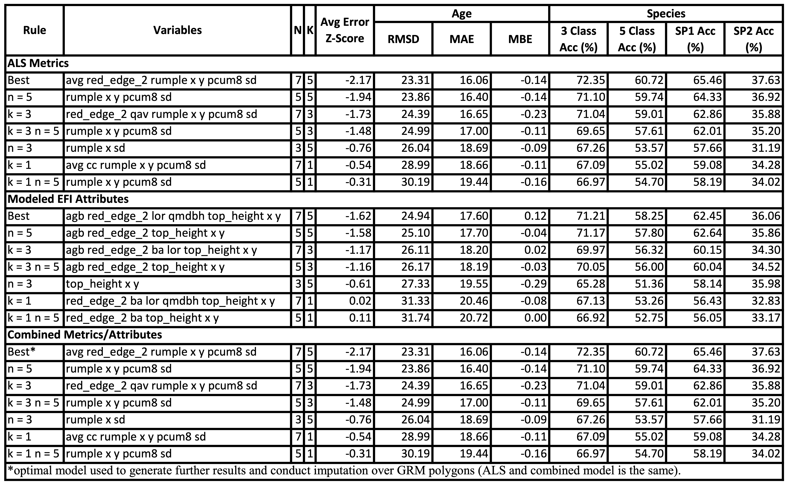

# **7** Imputation Performance Analysis: Comparing RMF and FSF {-#perf}

## **7.1** Introduction {-#perf71}

As mentioned earlier in the imputation workflow, we conducted a performance analysis to explore the optimal combination of imputation X-variables to use in the imputation algorithm. As we conducted this analysis in both the RMF and FSF (and ran the imputation algorithm in both these areas), it is worth sharing the results of the performance analyses. First, some background on the performance analysis itself.

We examined imputation performance using combinations of N = 3, N = 5, and N = 7 X-variables, and K = 1, K = 3, and K = 5 nearest neighbors. We filtered the X-variables into three categories: ALS metrics, EFI attributes, and all variables combined. We were interested to understand whether EFI attributes improved performance as opposed to using ALS metrics derived directly from the point cloud. We included Polygon centroid coordinates (x and) as well as Sentinel-2 red-edge 2 surface reflectance in all categories. We determined the optimal outputs by calculating an average error metric using the following logic:

1. We first derived the error (100 – accuracy) of the four species composition metrics and calculated the mean value. 
2. We then calculated z-scores by centering and scaling the RMSD of age and mean error of species composition by subtracting the mean from each value and dividing by the standard deviation.
3. We then averaged the two z-scores and used the minimum value to dictate optimal models, filtering by category (ALS, EFI, and combined) and combination of n and k. 

Because we calculated the average error z-scores on the full set of model outputs, we compared performance within as well as between categories.

We used the optimal set of X-variables for imputation in the RMF and FSF based on the performance analysis in each respective study area.

## **7.2** Results in RMF {-#perf72}

We do not run the entire code for the performance analysis here -- only results from optimal model outputs are displayed.

We ran the kNN imputation algorithm using every combination of 24 X-variables, n = 3/5/7 and k = 1/3/5. The optimal outputs from each category all had n = 7 and k = 5, and performed similarly with respect to accuracy when estimating age and species composition. Restricting n = 3 reduced age MAE and 5 functional group classification accuracy. N = 7 and N = 5 performed similarly. Restricting k = 3 reduced performance slightly. The rule k = 1 further reduced performance. The combined results are identical to the ALS only results, meaning EFI attributes did not increase performance in the RMF. Many ALS and EFI variables are highly correlated and therefore certain variables are interchangeable with similar performance.

## **7.3** Results in FSF {-#perf73}

In FSF, we had slightly different EFI attributes and ran the kNN imputation algorithm using every combination of 22 X-variables, n = 3/5/7 and k = 1/3/5. The optimal outputs varied substantially in characteristics when compared to the FRI. The optimal combined model had N = 7, K = 5, and a combination of mostly EFI attributes and one ALS metric (zpcum8). The optimal model in the ALS only category did not actually include any ALS metrics, only the three auxiliary variables: b6, x, and y. The optimal model from the EFI only category had N = 5. All optimal models had K = 5. 

## **7.4** Comparing Results {-#perf74}

The performance results from the RMF and FSF show different trends. ALS metrics were important drivers of imputation performance in the RMF, whereas in the FSF EFI attributes were much more important. In the FSF, an imputation model driven by the three auxiliary variables actually performed more optimally than when ALS metrics were included (ALS only category). The optimal combined model in the FSF included three EFI attributes: biomass (agb), basal area (ba), and gmvwl (gross merchantable volume whole log). MAE of age and leading/second species classification accuracy did not vary substantially between RMF and FSF. Three species classification accuracy was higher in FSF.

Why the varying results between the RMF and FSF? One idea is that The RMF and FSF comprise different ecosystems, with the FSF being more complex (based on number of different species included in photo-interpreted species composition). EFI attributes are calibrated with ground plots and thus may be more important to correct discrepancies in complex ecosystems.
